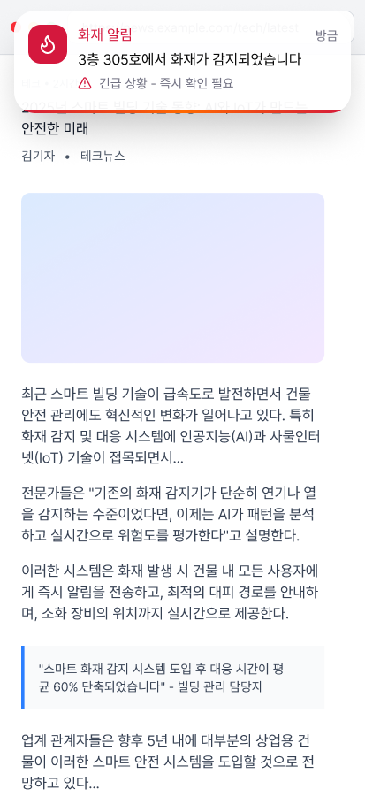
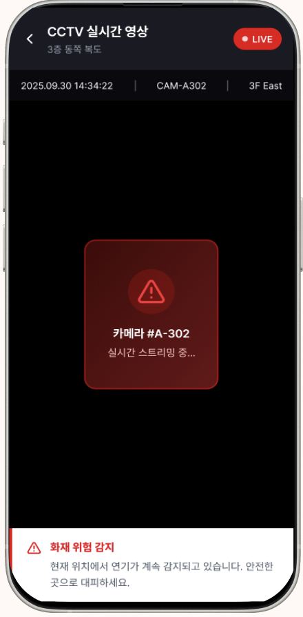
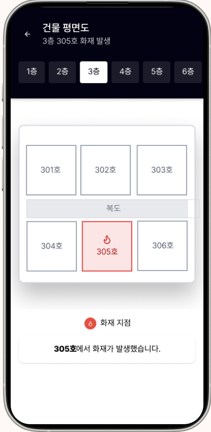

# Ember Sentinel Mobile Application

> INHA Univ. 캡스톤 디자인 - Ember Sentinel 프로젝트의 모바일 애플리케이션용 레포지토리입니다.

본 프로젝트는 Edge AI 카메라를 활용한 조기 화재 및 연기 감지 서비스의 모바일 클라이언트입니다. 실시간 CCTV 모니터링, 화재 경보 알림 수신, 방(Room) 및 카메라 관리 기능을 지원합니다.

## 핵심 기능

- **실시간 화재 경보**: Firebase Cloud Messaging(FCM)을 통한 실시간 푸시 알림 수신 및 화재 상세 정보 확인
- **CCTV 라이브 모니터링**: 등록된 카메라의 실시간 영상 스트리밍 시청
- **방(Room) 관리**: 건물 내 방 생성·삭제, 사용자 및 카메라 등록·해제
- **화재 이벤트 기록**: 과거 화재 감지 이벤트 이력 조회 및 녹화 영상 재생
- **소셜 로그인**: Google 및 Kakao 계정을 통한 간편 인증
- **오프라인 모드**: 네트워크 미연결 시에도 기본 기능 접근 가능

## 스크린샷

<table>
  <tr>
    <td align="center">
      
      <br /><b>푸시 알림</b>
      <br /><sub>화재 감지 시 실시간 푸시 알림 수신</sub>
    </td>
    <td align="center">
      
      <br /><b>화재 경보 상세</b>
      <br /><sub>위치, 시간, 위험도 등 상세 정보 확인</sub>
    </td>
    <td align="center">
      
      <br /><b>CCTV 실시간 영상</b>
      <br /><sub>현장 카메라 실시간 스트리밍</sub>
    </td>
    <td align="center">
      
      <br /><b>건물 평면도</b>
      <br /><sub>층별 평면도에서 화재 발생 위치 확인</sub>
    </td>
  </tr>
</table>

## 기술 스택

- **Framework**: React Native 0.81, Expo 54 (New Architecture)
- **Language**: JavaScript (React 19)
- **Navigation**: React Navigation 7 (Stack Navigator)
- **Push Notification**: Firebase 12 (FCM), Expo Notifications
- **Authentication**: Google Sign-In, Kakao SDK
- **Local Storage**: AsyncStorage
- **Build**: EAS Build (iOS / Android)

## 실행 방법

```bash
# 의존성 설치
npm install

# Expo 개발 서버 실행
npm start

# Android 빌드 및 실행
npm run android

# iOS 빌드 및 실행 (첫 빌드 시 cd ios && pod install 필요)
npm run ios
```

## 관련 레포지토리

- [ember-sentinel-server](https://github.com/JeffKM/ember-sentinel-server) - API 서버
- [ember-sentinel-ai](https://github.com/JeffKM/ember-sentinel-ai) - AI 화재 감지 모델
- [edge-IoT](https://github.com/JeffKM/edge-IoT) - Edge IoT 디바이스
- [Terraform-Bastion-Server](https://github.com/JeffKM/Terraform-Bastion-Server) - 인프라 IaC
