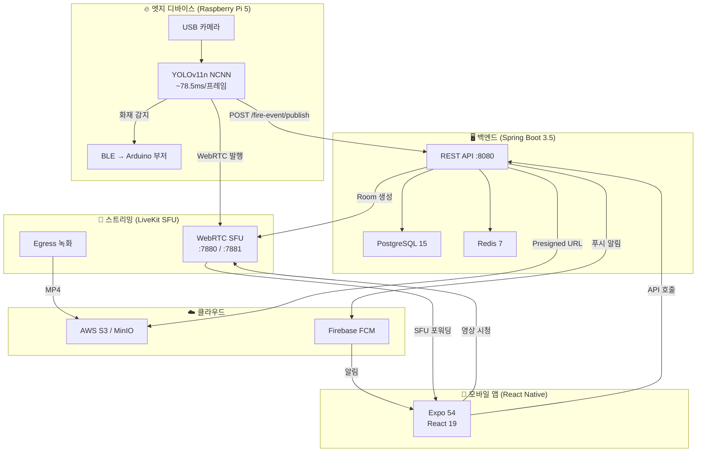
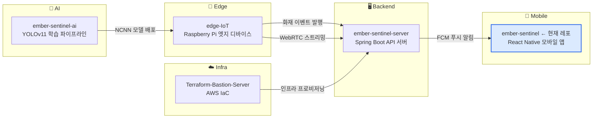

# 🔥 Ember Sentinel

> **Edge AI 기반 실시간 화재·연기 감지 및 CCTV 모니터링 시스템**

[](https://github.com/JeffKM/ember-sentinel/actions/workflows/ci.yml)
[](LICENSE)
[](https://reactnative.dev/)
[](https://expo.dev/)
[](https://spring.io/projects/spring-boot)
[](https://docs.ultralytics.com/)
[](https://www.terraform.io/)
[](https://github.com/JeffKM/ember-sentinel/releases/latest)

인하대학교 캡스톤 디자인 프로젝트 — USB 카메라와 Raspberry Pi에서 YOLOv11 모델로 화재/연기를 감지하고, WebRTC 실시간 스트리밍과 FCM 푸시 알림으로 즉시 대응할 수 있는 IoT 시스템입니다.

---

## 목차

- [시스템 아키텍처](#시스템-아키텍처)
- [레포지토리 구성](#레포지토리-구성)
- [기술 스택](#기술-스택)
- [다운로드](#다운로드)
- [데모 영상](#데모-영상)
- [구동 모습](#구동-모습)
- [시작하기](#시작하기)
- [모바일 앱 상세](#모바일-앱-상세)
- [아키텍처 문서](#아키텍처-문서)
- [API 문서](#api-문서)
- [프로젝트 구조](#프로젝트-구조)
- [라이선스](#라이선스)

---

## 시스템 아키텍처



**화재 감지 → 모바일 알림 수신까지 약 2~5초** ([상세 시퀀스 다이어그램](docs/diagrams/fire-detection-sequence.md))

---

## 레포지토리 구성

이 시스템은 5개의 레포지토리로 구성됩니다:



| 레포지토리                                                                         | 역할           | 기술 스택                                   | CI                                                                                                                                                                    |
| ---------------------------------------------------------------------------------- | -------------- | ------------------------------------------- | --------------------------------------------------------------------------------------------------------------------------------------------------------------------- |
| **[ember-sentinel](https://github.com/JeffKM/ember-sentinel)** (현재)              | 모바일 앱      | React Native 0.81, Expo 54, TypeScript      | [](https://github.com/JeffKM/ember-sentinel/actions/workflows/ci.yml)               |
| **[ember-sentinel-server](https://github.com/JeffKM/ember-sentinel-server)**       | 백엔드 API     | Java 17, Spring Boot 3.5, PostgreSQL, Redis | [](https://github.com/JeffKM/ember-sentinel-server/actions/workflows/ci.yml) |
| **[ember-sentinel-ai](https://github.com/JeffKM/ember-sentinel-ai)**               | AI 모델 학습   | Python, YOLOv11n, Ultralytics, NCNN         | -                                                                                                                                                                     |
| **[edge-IoT](https://github.com/JeffKM/edge-IoT)**                                 | 엣지 디바이스  | Python, OpenCV, LiveKit SDK, Bleak (BLE)    | [](https://github.com/JeffKM/edge-IoT/actions/workflows/ci.yml)                           |
| **[Terraform-Bastion-Server](https://github.com/JeffKM/Terraform-Bastion-Server)** | AWS 인프라 IaC | Terraform, AWS (EC2, RDS, S3, ECR)          | -                                                                                                                                                                     |

---

## 기술 스택

### 모바일 앱

| 분류              | 기술                                           |
| ----------------- | ---------------------------------------------- |
| Framework         | React Native 0.81 + Expo 54 (New Architecture) |
| Language          | TypeScript (React 19)                          |
| Navigation        | React Navigation 7 (Stack Navigator)           |
| Push Notification | Firebase 12 (FCM) + Expo Notifications         |
| Authentication    | Google Sign-In, Kakao SDK                      |
| Local Storage     | AsyncStorage                                   |
| Lint & Format     | ESLint 10 + Prettier 3.8 + Husky 9             |

### 백엔드

| 분류         | 기술                                       |
| ------------ | ------------------------------------------ |
| Framework    | Spring Boot 3.5 (Java 17)                  |
| Architecture | Layered + CQRS (Command/Query 분리)        |
| Database     | PostgreSQL 15 (JPA/Hibernate)              |
| Cache        | Redis 7 (JWT Refresh Token, FCM 토큰)      |
| Streaming    | LiveKit 0.10.1 (WebRTC SFU)                |
| Push         | Firebase Admin SDK 9.4.3                   |
| Storage      | AWS S3 (Presigned URL)                     |
| Docs         | Springdoc OpenAPI (Swagger UI)             |
| Auth         | JWT (jjwt 0.11.5) + OAuth2 (Google, Kakao) |
| Test         | JUnit 5, Testcontainers, JaCoCo (78.7%)    |
| Monitoring   | Actuator + Micrometer (P50/P95/P99)        |

### AI 모델

| 분류        | 기술                            |
| ----------- | ------------------------------- |
| Model       | YOLOv11n (2.6M 파라미터)        |
| Inference   | NCNN (FP16 Half Precision)      |
| Dataset     | FASDD_CV (fire, smoke 2클래스)  |
| Performance | fire AP=90.3%, smoke AP=83.9%   |
| Edge Speed  | ~78.5ms/프레임 (Raspberry Pi 5) |

### 엣지 디바이스

| 분류          | 기술                                         |
| ------------- | -------------------------------------------- |
| Hardware      | Raspberry Pi 5 + USB 카메라                  |
| Local Alert   | Arduino Nano 33 BLE + 부저                   |
| Communication | BLE (경보), WebRTC (스트리밍), HTTP (이벤트) |
| Resilience    | 지수 백오프 재시도, 카메라 장애 자동 복구    |

### 인프라

| 분류        | 기술                                                   |
| ----------- | ------------------------------------------------------ |
| IaC         | Terraform (4모듈: networking/compute/database/storage) |
| Cloud       | AWS (EC2, RDS, S3, ECR, VPC)                           |
| CI/CD       | GitHub Actions + OIDC → ECR → SSM 배포                 |
| Container   | Docker (멀티스테이지 빌드)                             |
| PaaS (대안) | Render / Railway 배포 설정 포함                        |

---

## 다운로드

| 플랫폼  | 다운로드                                                                          | 비고              |
| ------- | --------------------------------------------------------------------------------- | ----------------- |
| Android | [**최신 APK 다운로드**](https://github.com/JeffKM/ember-sentinel/releases/latest) | Android 8.0+ 지원 |

> 설치 시 "출처를 알 수 없는 앱" 허용이 필요합니다.

---

## 데모 영상

### E2E 플로우 (실기기 Android APK)

<table>
  <tr>
    <td align="center">
      
      <br /><b>화재 감지 → 푸시 알림</b>
      <br /><sub>엣지 YOLO 감지 → FCM 알림 → 화재 상세</sub>
    </td>
    <td align="center">
      
      <br /><b>실시간 CCTV 스트리밍</b>
      <br /><sub>LiveKit WebRTC 실시간 영상 수신</sub>
    </td>
    <td align="center">
      
      <br /><b>녹화 영상 재생</b>
      <br /><sub>S3 Presigned URL 녹화 재생</sub>
    </td>
  </tr>
</table>

### E2E 동작 검증 시나리오

```
1. macOS에서 웹캠 시뮬레이터 실행 → YOLO 화재/연기 감지
2. 실기기(Android)에서 FCM 푸시 알림 수신
3. 알림 탭 → CCTVLiveScreen에서 LiveKit WebRTC 실시간 영상 확인
4. 스트리밍 종료 후 FireEventHistory → S3 녹화 영상 재생
```

> GIF 녹화 방법: [docs/demos/README.md](docs/demos/README.md) 참조
>
> ```bash
> # Android 실기기 미러링 + 녹화 (scrcpy)
> scrcpy --record demo-raw.mp4
> # MP4 → GIF 변환
> ffmpeg -i demo-raw.mp4 -vf "fps=15,scale=300:-1:flags=lanczos,split[s0][s1];[s0]palettegen[p];[s1][p]paletteuse" -loop 0 demo.gif
> ```

---

## 구동 모습

> **준비 중**: 전체 E2E 시연 영상을 촬영하여 업로드할 예정입니다.
>
> **포함 예정 내용**: 소셜 로그인 → 홈 대시보드 → 화재 감지 푸시 알림 → CCTV 실시간 스트리밍 → 녹화 영상 재생 → 건물 평면도

---

## 시작하기

### 사전 요구사항

- **Node.js** 20+
- **npm** 10+
- **Expo CLI** (`npx expo`)
- Android Studio 또는 Xcode (네이티브 빌드 시)
- **iOS 빌드 시 추가 필요**: CocoaPods, Xcode 15+, `GoogleService-Info.plist` (Firebase)

### 모바일 앱 실행 (데모 모드)

서버 없이도 전체 화면 흐름을 시연할 수 있습니다:

```bash
# 1. 레포 클론
git clone https://github.com/JeffKM/ember-sentinel.git
cd ember-sentinel

# 2. 의존성 설치
npm install

# 3. Expo 개발 서버 실행
npm start

# 4. Expo Go 앱으로 QR 코드 스캔 또는 에뮬레이터에서 실행
```

> 서버 미연결 시 자동으로 데모 모드가 활성화되어 샘플 데이터(건물 3개, 방 5개, 카메라 8개, 화재 이벤트 10개)로 동작합니다.

### 전체 시스템 실행 (Docker Compose)

```bash
# 1. 백엔드 서버 클론 및 실행
git clone https://github.com/JeffKM/ember-sentinel-server.git
cd ember-sentinel-server
cp .env.example .env          # 환경 변수 설정
docker compose up -d          # PostgreSQL, Redis, LiveKit, MinIO, API 서버 기동

# 2. 모바일 앱에서 서버 URL 설정
cd ../ember-sentinel
cp .env.example .env          # EXPO_PUBLIC_API_BASE_URL 설정
npm start
```

### iOS 로컬 빌드 (필수 사전 설정)

iOS 빌드에는 추가 설정이 필요합니다. 아래 순서를 따라주세요:

```bash
# 1. 환경변수 설정
cp .env.example .env
# .env 파일을 열어 실제 값 입력 (Firebase, Google OAuth, Kakao 등)

# 2. GoogleService-Info.plist 배치 (Firebase 필수)
#    Firebase Console > 프로젝트 설정 > 내 앱 > iOS (com.embersentinel.app)
#    → GoogleService-Info.plist 다운로드
#    → ios/EmberSentinel/ 디렉토리에 복사
cp ~/Downloads/GoogleService-Info.plist ios/EmberSentinel/

# 3. Expo prebuild (네이티브 프로젝트 생성/갱신)
npx expo prebuild --clean

# 4. CocoaPods 의존성 설치
cd ios && pod install && cd ..

# 5. iOS 시뮬레이터에서 실행
npm run ios                   # expo run:ios
```

> **주의**: `GoogleService-Info.plist`와 `.env` 파일은 보안상 git에 포함되지 않습니다.
> 프로젝트 관리자에게 파일을 전달받거나, Firebase/Google/Kakao Console에서 직접 발급받으세요.

### iOS 시뮬레이터 빌드 배포 (테스터용)

Apple Developer 계정 없이 테스터에게 iOS 앱을 전달하는 방법입니다.
테스터는 git clone, 환경변수 설정, pod install 없이 바로 테스트할 수 있습니다.

**빌드하는 사람 (개발자)**:

```bash
# 1. 시뮬레이터용 Release 빌드
npx expo run:ios --configuration Release

# 2. 빌드된 .app 압축
cd ios/build/Build/Products/Release-iphonesimulator
zip -r ~/Desktop/EmberSentinel-sim.zip EmberSentinel.app

# 3. EmberSentinel-sim.zip을 테스터에게 전달 (Slack, 카톡, 이메일 등)
```

**테스트하는 사람 (테스터)**:

```bash
# 1. 압축 해제
unzip EmberSentinel-sim.zip

# 2. macOS 격리 속성 제거 (zip 다운로드 시 자동 부여되어 설치 차단됨)
xattr -cr EmberSentinel.app

# 3. 시뮬레이터 부팅
open -a Simulator

# 4. 앱 설치 및 실행
xcrun simctl install booted EmberSentinel.app
xcrun simctl launch booted com.embersentinel.app
```

> **시뮬레이터 제한사항**: FCM 푸시 알림, 카메라는 실기기 전용이라 동작하지 않습니다.
> UI 흐름, API 호출, 소셜 로그인, 데모 모드 테스트에는 충분합니다.

### 플랫폼별 빌드

```bash
# Android
npm run android               # expo run:android

# iOS (첫 빌드 시 위의 iOS 로컬 빌드 섹션 참고)
npm run ios                   # expo run:ios

# 웹 (번들링 검증)
npx expo export --platform web

# EAS 빌드 — 실기기 APK (LiveKit WebRTC 동작에 필수)
eas build --platform android --profile preview

# EAS 빌드 (프로덕션 — Google Play Store용)
eas build --platform android --profile production
```

> LiveKit WebRTC는 네이티브 빌드 필수 — Expo Go에서 동작하지 않습니다.
> 상세 가이드: [docs/eas-build-guide.md](docs/eas-build-guide.md)

---

## 모바일 앱 상세

### 화면 구성 (9개 화면)

| 화면                     | 설명                                                |
| ------------------------ | --------------------------------------------------- |
| `SplashScreen`           | 앱 시작 화면                                        |
| `LoginScreen`            | Google / Kakao 소셜 로그인                          |
| `HomeScreen`             | 방 목록, 화재 상태 대시보드, 시뮬레이션 버튼 (데모) |
| `RoomDetailScreen`       | 방 상세 — 멤버, 카메라, 화재 이벤트 목록            |
| `FireAlertDetailScreen`  | 화재 경보 상세 — 위치, 시간, 위험도                 |
| `CCTVLiveScreen`         | WebRTC 실시간 CCTV 영상 시청                        |
| `FireLocationScreen`     | 층별 평면도에서 화재 발생 위치 확인                 |
| `FireEventHistoryScreen` | 과거 화재 이벤트 이력 조회                          |
| `FireEventVideoScreen`   | S3 녹화 영상 재생 (Presigned URL)                   |

### 인증 흐름

```
소셜 로그인 (Google/Kakao)
  → POST /auth/google 또는 /auth/kakao
  → JWT(accessToken) + refreshToken 발급
  → AsyncStorage 저장
  → FCM 토큰 서버 등록
  → 401 시 자동 토큰 갱신 (refresh → 재시도)
```

### 개발 도구

```bash
npm run lint                  # ESLint 검사
npm run lint:fix              # ESLint 자동 수정
npm run format                # Prettier 포맷팅
npm run type-check            # TypeScript 타입 체크
```

> pre-commit 훅(Husky + lint-staged)이 커밋 시 자동으로 ESLint + Prettier를 실행합니다.

---

## 아키텍처 문서

### ADR (Architecture Decision Records)

기술 선택의 근거를 문서화한 8개의 ADR:

| ADR                                                    | 제목                                | 핵심 결정                                       |
| ------------------------------------------------------ | ----------------------------------- | ----------------------------------------------- |
| [ADR-001](docs/adr/ADR-001-sfu-livekit.md)             | 실시간 스트리밍에 SFU(LiveKit) 선택 | P2P/MCU 대신 SFU — 1:N 확장성 + Egress 녹화     |
| [ADR-002](docs/adr/ADR-002-yolov11n-ncnn.md)           | YOLOv11n + NCNN 엣지 추론           | 2.6M 파라미터, RPi5에서 78.5ms 실시간 추론      |
| [ADR-003](docs/adr/ADR-003-cqrs-architecture.md)       | CQRS 아키텍처 도입                  | Command/Query 분리로 유지보수성 향상            |
| [ADR-004](docs/adr/ADR-004-react-native-expo.md)       | React Native + Expo 선택            | 크로스플랫폼 + OTA 업데이트 + 빠른 프로토타이핑 |
| [ADR-005](docs/adr/ADR-005-ble-low-power.md)           | BLE 저전력 경보 통신                | WiFi/Zigbee 대신 BLE — 저전력 + 저지연          |
| [ADR-006](docs/adr/ADR-006-jwt-oauth2-auth.md)         | JWT + OAuth2 인증                   | Refresh Token 회전 + 재사용 감지                |
| [ADR-007](docs/adr/ADR-007-terraform-iac.md)           | Terraform IaC                       | 4모듈 분리, dev/prod 환경 관리                  |
| [ADR-008](docs/adr/ADR-008-webrtc-egress-recording.md) | WebRTC Egress 녹화                  | LiveKit Egress → S3 자동 저장                   |

### 다이어그램

| 다이어그램                                                   | 설명                                                                 |
| ------------------------------------------------------------ | -------------------------------------------------------------------- |
| [화재 감지 시퀀스](docs/diagrams/fire-detection-sequence.md) | 감지 → BLE 경보 → 서버 발행 → FCM 알림 → WebRTC 스트리밍 → 녹화 저장 |
| [인증 흐름 시퀀스](docs/diagrams/auth-flow-sequence.md)      | 소셜 로그인 → JWT 발급 → 토큰 갱신 → Refresh Token 회전              |
| [인프라 아키텍처](docs/diagrams/infra-architecture.md)       | AWS 리소스 관계도 + 보안 그룹 + Docker Compose + CI/CD               |

### 추가 문서

| 문서                                                    | 설명                                    |
| ------------------------------------------------------- | --------------------------------------- |
| [PRD](docs/PRD.md)                                      | 프로젝트 요구사항 정의서                |
| [ROADMAP](docs/ROADMAP.md)                              | 개발 로드맵 (16 Phase, 73 태스크)       |
| [인프라 비용 분석](docs/infra-cost-analysis.md)         | AWS 월 ~$197 상세, 4가지 대안 비교      |
| [EAS 빌드 가이드](docs/eas-build-guide.md)              | EAS Build로 Android APK/iOS 빌드 가이드 |
| [Phase 15 실행 가이드](docs/phase15-execution-guide.md) | 프로덕션 데모 환경 구축 상세 실행 절차  |

---

## API 문서

### Swagger UI

백엔드 서버 실행 후 Swagger UI에서 전체 API를 확인할 수 있습니다:

```
http://localhost:8080/swagger-ui/index.html
```

### Postman Collection

주요 API 엔드포인트가 포함된 Postman Collection을 제공합니다:

- **파일**: [`docs/api/ember-sentinel-api.postman_collection.json`](docs/api/ember-sentinel-api.postman_collection.json)
- Postman에서 **Import** → 파일 선택으로 바로 사용 가능

### 주요 API 엔드포인트

| Method | 경로                                | 설명                      | 인증    |
| ------ | ----------------------------------- | ------------------------- | ------- |
| `POST` | `/auth/google`                      | Google 소셜 로그인        | -       |
| `POST` | `/auth/kakao`                       | Kakao 소셜 로그인         | -       |
| `POST` | `/auth/token/refresh`               | JWT 재발급                | -       |
| `GET`  | `/user/info`                        | 사용자 정보 조회          | JWT     |
| `POST` | `/user/fcm/token`                   | FCM 토큰 등록             | JWT     |
| `GET`  | `/room/list/me`                     | 내 방 목록 (페이징)       | JWT     |
| `GET`  | `/room/{roomId}/detail`             | 방 상세 정보              | JWT     |
| `POST` | `/room`                             | 방 생성                   | JWT     |
| `POST` | `/room/{roomId}/camera-edge`        | 카메라 등록               | JWT     |
| `POST` | `/embedded/fire-event/publish`      | 화재 이벤트 발행 (엣지용) | API Key |
| `GET`  | `/fire-event/{id}/stream/subscribe` | CCTV 라이브 시청 토큰     | JWT     |
| `GET`  | `/fire-event/{id}/record`           | 녹화 영상 Presigned URL   | JWT     |

---

## 프로젝트 구조

```
ember-sentinel/
├── App.tsx                       # 루트 컴포넌트 (네비게이션 + AuthProvider)
├── src/
│   ├── screens/                  # 화면 컴포넌트 (9개)
│   │   ├── SplashScreen.tsx
│   │   ├── LoginScreen.tsx
│   │   ├── HomeScreen.tsx
│   │   ├── RoomDetailScreen.tsx
│   │   ├── FireAlertDetailScreen.tsx
│   │   ├── CCTVLiveScreen.tsx
│   │   ├── FireLocationScreen.tsx
│   │   ├── FireEventHistoryScreen.tsx
│   │   └── FireEventVideoScreen.tsx
│   ├── config/                   # 설정
│   │   ├── api.ts                # API 클라이언트 (Bearer 토큰, 자동 갱신)
│   │   ├── firebase.ts           # FCM 토큰 발급 및 리스너
│   │   └── socialLogin.ts        # Google/Kakao 소셜 로그인
│   ├── components/               # 재사용 UI 컴포넌트
│   │   ├── PushNotificationBanner.tsx   # 포그라운드 푸시 알림 배너
│   │   ├── LiveKitVideoView.tsx         # LiveKit WebRTC 영상 뷰
│   │   ├── ConnectionStatusOverlay.tsx  # 연결 상태 오버레이
│   │   ├── CCTVParticles.tsx            # CCTV 시뮬레이션 파티클
│   │   └── floor-plan/                  # 건물 평면도 컴포넌트
│   │       ├── FloorSelector.tsx        # 층 선택 (B1~12층)
│   │       ├── RoomCell.tsx             # 방 셀 (화재 애니메이션)
│   │       ├── FloorPlanView.tsx        # 평면도 레이아웃
│   │       └── EvacuationOverlay.tsx    # 대피 경로 오버레이
│   ├── contexts/                 # AuthContext (인증 상태 관리)
│   ├── hooks/                    # 커스텀 훅
│   │   └── useLiveKitStream.ts   # LiveKit WebRTC 스트리밍 훅
│   ├── data/                     # 데모 데이터 세트
│   ├── types/                    # TypeScript 도메인 타입
│   └── utils/                    # 유틸리티
│       ├── networkTest.ts        # 네트워크 연결 테스트
│       ├── pushNotification.ts   # 푸시 알림 유틸
│       └── floorUtils.ts         # 층/방 파싱 및 생성 유틸
├── docs/
│   ├── adr/                      # Architecture Decision Records (8개)
│   ├── diagrams/                 # Mermaid 다이어그램 (3개)
│   ├── api/                      # Postman Collection
│   ├── demos/                    # 데모 GIF 영상
│   ├── screenshots/              # 앱 스크린샷
│   ├── PRD.md                    # 프로젝트 요구사항 정의서
│   ├── ROADMAP.md                # 개발 로드맵
│   ├── infra-cost-analysis.md    # 인프라 비용 분석
│   ├── eas-build-guide.md        # EAS Build 가이드
│   └── phase15-execution-guide.md # 프로덕션 데모 실행 가이드
├── .github/workflows/ci.yml     # GitHub Actions CI
├── tsconfig.json                 # TypeScript 설정 (strict)
├── eslint.config.mjs             # ESLint 10 (flat config)
└── .prettierrc                   # Prettier 설정
```

---

## 라이선스

이 프로젝트는 MIT 라이선스를 따릅니다. 자세한 내용은 [LICENSE](LICENSE) 파일을 참조하세요.

---

<div align="center">

**인하대학교 캡스톤 디자인 — 팀 `inha-capstone-04`**

[이슈 등록](https://github.com/JeffKM/ember-sentinel/issues) · [Pull Request](https://github.com/JeffKM/ember-sentinel/pulls)

</div>
