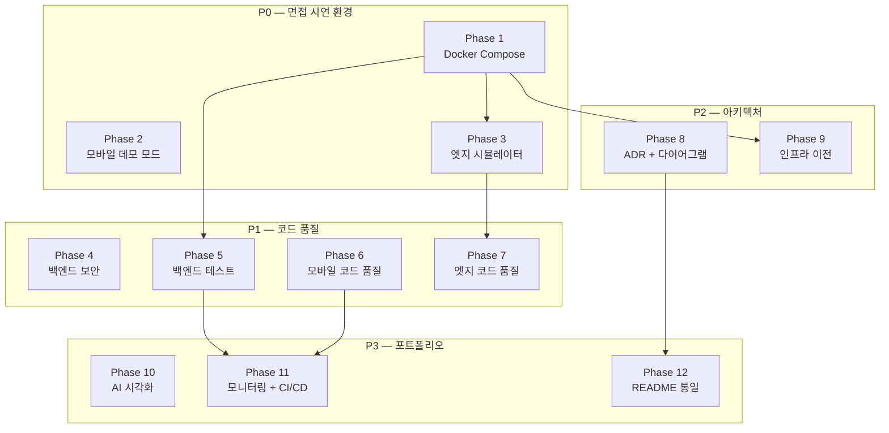

# Ember Sentinel — 개발 로드맵

> **기준 문서**: [PRD.md](./PRD.md) v1.0
> **최종 갱신일**: 2026-05-21 <!-- Phase 5 완료 반영 -->
> **목표**: 면접 시연 및 포트폴리오 활용을 위한 전체 시스템 개선 실행 계획

---

## 진행 상황 요약

| Phase | 이름 | 우선순위 | 태스크 수 | 상태 | 진행률 |
|:-----:|------|:--------:|:---------:|:----:|:------:|
| 1 | 로컬 개발 환경 (Docker Compose) | P0 | 6 | ✅ 완료 | 6/6 |
| 2 | 모바일 앱 데모 모드 | P0 | 4 | ✅ 완료 | 4/4 |
| 3 | 엣지 IoT 시뮬레이터 | P0 | 3 | ✅ 완료 | 3/3 |
| 4 | 백엔드 보안 강화 | P1 | 3 | ✅ 완료 | 3/3 |
| 5 | 백엔드 테스트 강화 | P1 | 4 | ✅ 완료 | 4/4 |
| 6 | 모바일 앱 코드 품질 | P1 | 4 | 🔲 대기 | 0/4 |
| 7 | 엣지 IoT 코드 품질 | P1 | 3 | 🔲 대기 | 0/3 |
| 8 | 아키텍처 문서화 (ADR + 다이어그램) | P2 | 4 | 🔲 대기 | 0/4 |
| 9 | 인프라 이전 및 비용 최적화 | P2 | 3 | 🔲 대기 | 0/3 |
| 10 | AI 모델 시각화 및 실험 | P3 | 4 | 🔲 대기 | 0/4 |
| 11 | 모니터링 및 CI/CD | P3 | 6 | 🔲 대기 | 0/6 |
| 12 | 문서 및 README 통일 | P3 | 3 | 🔲 대기 | 0/3 |
| | **합계** | | **47** | | **20/47** |

---

## Phase 1: 로컬 개발 환경 (Docker Compose)

> **PRD 섹션**: 3.1 | **우선순위**: P0 | **대상 레포**: `ember-sentinel-server`

**목표**: `docker compose up` 한 번으로 백엔드 전체 스택(PostgreSQL, Redis, LiveKit, MinIO, API 서버)을 기동하여 AWS 비용 없이 면접 시연 가능한 환경 구축

**선행 조건**: 없음

| ID | 태스크 | 상태 | 비고 |
|:---:|--------|:----:|------|
| T-001 | Docker Compose 파일 작성 | ✅ | PostgreSQL, Redis, LiveKit, MinIO, API 서버 통합 |
| T-002 | `application-local.yml` 프로필 추가 | ✅ | 로컬 Docker 환경용 설정. 의존: T-001 |
| T-003 | DB 초기화 스크립트 작성 | ✅ | `init.sql` — 테이블 생성 + 시드 데이터. 의존: T-001 |
| T-004 | LiveKit 로컬 설정 | ✅ | `livekit-local.yaml` — 로컬 API Key/Secret. 의존: T-001 |
| T-005 | MinIO 버킷 자동 생성 | ✅ | `mc` CLI로 버킷 초기화. 의존: T-001 |
| T-006 | 환경 변수 가이드 문서 | ✅ | `.env.example` + 로컬 실행 가이드. 의존: T-001~T-005 |

**완료 기준**: `docker compose up` 후 3분 내 전체 서비스 정상 응답 (PRD 섹션 11)

---

## Phase 2: 모바일 앱 데모 모드 ✅

> **PRD 섹션**: 3.2 | **우선순위**: P0 | **대상 레포**: `ember-sentinel`

**목표**: 서버 연결 없이도 전체 화면 흐름 시연 가능. 서버 연결 시에는 실제 데이터로 동작.

**선행 조건**: 없음 (Phase 1과 병렬 진행 가능)

| ID | 태스크 | 상태 | 비고 |
|:---:|--------|:----:|------|
| T-007 | 데모 데이터 세트 확충 | ✅ | `src/data/demoData.js` — 건물 3개, 방 5개, 카메라 8개, 화재 이벤트 10개 |
| T-008 | API base URL 환경 변수화 | ✅ | `EXPO_PUBLIC_API_BASE_URL` 환경 변수, `.env.example` 추가 |
| T-009 | CCTV 화면 데모 영상 | ✅ | `expo-video` 연동, MP4 폴백 지원, CCTVLive/FireEventVideo 화면 개선 |
| T-010 | 화재 이벤트 수동 트리거 | ✅ | HomeScreen 시뮬레이션 버튼 + DEV 헬퍼 `simulateFire()` |

**완료 기준**: 서버 없이 9개 화면 모두 탐색 가능 (PRD 섹션 11)

---

## Phase 3: 엣지 IoT 시뮬레이터 ✅

> **PRD 섹션**: 3.3 | **우선순위**: P0 | **대상 레포**: `edge-IoT`

**목표**: 라즈베리파이 없이 노트북에서 엣지 디바이스 동작을 시뮬레이션

**선행 조건**: Phase 1 (T-001) — 시뮬레이터가 API 서버에 이벤트를 발행하려면 로컬 서버 필요

| ID | 태스크 | 상태 | 비고 |
|:---:|--------|:----:|------|
| T-011 | 엣지 시뮬레이터 스크립트 | ✅ | `simulator.py` — 웹캠/샘플 영상으로 YOLO 추론 + API 호출. 의존: T-001 |
| T-012 | 설정 파일 외부화 | ✅ | `config.yaml` + `config_loader.py`로 서버 URL, 모델 경로, BLE MAC 등 분리 |
| T-013 | BLE 모킹 | ✅ | `--no-ble` 플래그 + `MockBLEClient`로 BLE 없이 실행 가능. 의존: T-012 |

**완료 기준**: 엣지 시뮬레이터 → 푸시 알림 → 영상 확인까지 30초 내 (PRD 섹션 11)

---

## Phase 4: 백엔드 보안 강화 ✅

> **PRD 섹션**: 4.1 | **우선순위**: P1 | **대상 레포**: `ember-sentinel-server`

**목표**: 면접 예상 질문 "엣지 디바이스의 API 인증은 어떻게 처리하나요?"에 대한 답변 근거 마련

**선행 조건**: 없음 (Phase 1 완료 후 진행 권장)

| ID | 태스크 | 상태 | 비고 |
|:---:|--------|:----:|------|
| T-014 | 엣지 디바이스 API Key 인증 | ✅ | `X-Device-API-Key` 헤더 검증, CameraEdge에 `api_key` 필드 추가, DeviceAuthInterceptor 신규 |
| T-015 | Rate Limiting 적용 | ✅ | Redis INCR+EXPIRE 기반 디바이스별 1분 1회 제한, RateLimitService 신규. 의존: T-014 |
| T-016 | JWT Refresh Token 회전 | ✅ | SHA-256 블랙리스트 기반 재사용 감지, 감지 시 전체 토큰 무효화 + 강제 재로그인 |

**완료 기준**: 인증 없는 `/embedded/fire-event/publish` 호출 시 401 반환, Rate Limit 초과 시 429 반환

---

## Phase 5: 백엔드 테스트 강화 ✅

> **PRD 섹션**: 4.2 | **우선순위**: P1 | **대상 레포**: `ember-sentinel-server`

**목표**: 면접 예상 질문 "테스트 전략은 어떻게 가져가셨나요?"에 대한 실질적 답변 근거

**선행 조건**: Phase 1 (T-001) — Testcontainers 통합 테스트에 Docker 환경 필요

| ID | 태스크 | 상태 | 비고 |
|:---:|--------|:----:|------|
| T-017 | 핵심 도메인 단위 테스트 | ✅ | `FireEventCommandService`, `AuthService`, `RoomCommandService` 등 30개 테스트 클래스 |
| T-018 | 통합 테스트 (Testcontainers) | ✅ | `@SpringBootTest` + Testcontainers (PostgreSQL, Redis). Docker 29.x 호환성 수정 |
| T-019 | API 엔드포인트 테스트 | ✅ | MockMvc로 주요 API 성공/실패 케이스. 143개 테스트 전체 통과 |
| T-020 | 테스트 커버리지 리포트 | ✅ | JaCoCo 커버리지 78.7% 달성 (목표 70%). CI에 리포트 자동 생성 추가 |

**완료 기준**: 백엔드 핵심 도메인 테스트 커버리지 70% 이상 (PRD 섹션 11)

---

## Phase 6: 모바일 앱 코드 품질

> **PRD 섹션**: 4.3 | **우선순위**: P1 | **대상 레포**: `ember-sentinel`

**목표**: JavaScript → TypeScript 전환 및 코드 품질 체계 구축

**선행 조건**: 없음 (Phase 2와 병렬 진행 가능하나, 충돌 방지를 위해 Phase 2 완료 후 권장)

| ID | 태스크 | 상태 | 비고 |
|:---:|--------|:----:|------|
| T-021 | TypeScript 마이그레이션 | 🔲 | `.js` → `.tsx`/`.ts` 전환, 점진적 마이그레이션 (화면 단위) |
| T-022 | API 에러 핸들링 통합 | 🔲 | 자동 토큰 갱신, 에러 분류, 사용자 피드백. 의존: T-021 |
| T-023 | 상태 관리 개선 | 🔲 | AsyncStorage → Context 또는 Zustand로 인증 상태 중앙 관리. 의존: T-021 |
| T-024 | ESLint + Prettier 설정 | 🔲 | 코드 스타일 일관성 + `husky` pre-commit 훅. 의존: T-021 |

**완료 기준**: 전체 `.js` 파일이 `.ts`/`.tsx`로 전환되고, ESLint/Prettier 통과

---

## Phase 7: 엣지 IoT 코드 품질

> **PRD 섹션**: 4.4 | **우선순위**: P1 | **대상 레포**: `edge-IoT`

**목표**: 하드코딩 제거 및 프로덕션급 에러 핸들링/로깅 체계 구축

**선행 조건**: Phase 3 (T-012) — 설정 파일 외부화가 하드코딩 제거의 기반

| ID | 태스크 | 상태 | 비고 |
|:---:|--------|:----:|------|
| T-025 | 하드코딩 제거 | 🔲 | 모든 IP/URL/MAC/모델 경로를 `config.yaml`로 외부화. 의존: T-012 |
| T-026 | 에러 핸들링 강화 | 🔲 | 네트워크 재시도, BLE 연결 실패 로깅, 카메라 장애 복구 |
| T-027 | 로깅 체계 구축 | 🔲 | `logging` 모듈, 파일 로테이션, 레벨별 구분 |

**완료 기준**: `config.yaml` 수정만으로 환경 전환 가능, 에러 시 자동 복구 또는 로깅

---

## Phase 8: 아키텍처 문서화 (ADR + 다이어그램)

> **PRD 섹션**: 5.2 + 5.3 | **우선순위**: P2 | **대상 레포**: `ember-sentinel` (docs/), `Terraform-Bastion-Server`

**목표**: 면접에서 "왜 이 기술을 선택했는가?"에 즉답 가능한 문서 체계 구축

**선행 조건**: 없음

| ID | 태스크 | 상태 | 비고 |
|:---:|--------|:----:|------|
| T-031 | ADR 문서 8개 작성 | 🔲 | `docs/adr/` — SFU, YOLO, CQRS, RN, BLE, JWT, Terraform, Egress |
| T-032 | 화재 감지 시퀀스 다이어그램 | 🔲 | Mermaid — 화재 감지 → 알림 → 스트리밍 전체 흐름 |
| T-033 | 인증 흐름 다이어그램 | 🔲 | Mermaid — 소셜 로그인 → JWT 발급 → 토큰 갱신 |
| T-034 | 인프라 아키텍처 다이어그램 | 🔲 | draw.io/Mermaid — AWS 리소스 관계도 (Terraform 레포) |

**완료 기준**: ADR 8개 + 시퀀스 다이어그램 2개 + 인프라 다이어그램 1개 완성 (PRD 섹션 11)

---

## Phase 9: 인프라 이전 및 비용 최적화

> **PRD 섹션**: 5.1 | **우선순위**: P2 | **대상 레포**: `Terraform-Bastion-Server`, `ember-sentinel-server`

**목표**: 포트폴리오 시연용 상시 운영 환경을 최소 비용으로 유지 (권장: 로컬 Docker 기본, 필요 시 Railway/Render)

**선행 조건**: Phase 1 (T-001) — Docker 환경이 Railway/Render 배포의 기반

| ID | 태스크 | 상태 | 비고 |
|:---:|--------|:----:|------|
| T-028 | Terraform 모듈 리팩토링 | 🔲 | 환경별 분리 (dev/prod), 비용 태그 추가 |
| T-029 | 인프라 비용 분석 문서 | 🔲 | AWS 리소스별 월 비용 breakdown + 대안 비교표 |
| T-030 | Railway/Render 배포 설정 | 🔲 | Dockerfile 최적화, 배포 설정 파일 작성. 의존: T-001 |

**완료 기준**: 비용 분석 문서 완성, Railway/Render 배포 설정으로 외부 데모 URL 확보 가능

---

## Phase 10: AI 모델 시각화 및 실험

> **PRD 섹션**: 6.1 | **우선순위**: P3 | **대상 레포**: `ember-sentinel-ai`

**목표**: AI 모델 학습 과정과 성능을 시각적으로 보여줄 수 있는 자료 생산

**선행 조건**: 없음

| ID | 태스크 | 상태 | 비고 |
|:---:|--------|:----:|------|
| T-035 | 학습 결과 시각화 대시보드 | 🔲 | loss curve, mAP 변화, confusion matrix, PR curve |
| T-036 | 모델 비교 실험 | 🔲 | YOLOv11n vs YOLOv11s, epoch 수별, 이미지 크기별 비교표 |
| T-037 | 데이터 증강 실험 | 🔲 | Mosaic, MixUp, RandomFlip 적용 전/후 비교. 의존: T-036 |
| T-038 | 추론 속도 벤치마크 | 🔲 | 디바이스별 (RPi5, 맥북, 서버) 추론 속도 비교표 |

**완료 기준**: 모델 성능 시각화 자료 + 비교 실험 결과표 완성

---

## Phase 11: 모니터링 및 CI/CD

> **PRD 섹션**: 6.2 + 6.3 | **우선순위**: P3 | **대상 레포**: 전체

**목표**: 관측성 확보 및 전체 레포 CI/CD 파이프라인 통일

**선행 조건**: Phase 5 (T-017~T-019) — 백엔드 CI 개선에 테스트 필요, Phase 6 (T-021) — 모바일 CI에 TS 전환 필요

| ID | 태스크 | 상태 | 비고 |
|:---:|--------|:----:|------|
| T-039 | Spring Boot Actuator 메트릭 | 🔲 | health, info, metrics 엔드포인트 활성화 |
| T-040 | 구조화된 로깅 | 🔲 | JSON 형식 로깅 (Logback), 요청/응답 인터셉터 |
| T-041 | API 응답 시간 측정 | 🔲 | P50/P95/P99 응답 시간 메트릭. 의존: T-039 |
| T-042 | 모바일 앱 CI 추가 | 🔲 | GitHub Actions — lint, type-check, 빌드 검증. 의존: T-021 |
| T-043 | 엣지 IoT CI 추가 | 🔲 | GitHub Actions — ruff lint, mypy type-check |
| T-044 | 백엔드 CI 개선 | 🔲 | Testcontainers 통합 테스트 + 커버리지 자동 발행. 의존: T-017~T-019 |

**완료 기준**: 전체 레포 CI 파이프라인 통과, Actuator 메트릭 엔드포인트 응답 확인

---

## Phase 12: 문서 및 README 통일

> **PRD 섹션**: 6.4 | **우선순위**: P3 | **대상 레포**: 전체

**목표**: GitHub 레포만으로 기술력을 보여줄 수 있는 수준의 문서 완성도 달성

**선행 조건**: Phase 8 (T-032) — 프로젝트 포털 README에 다이어그램 참조

| ID | 태스크 | 상태 | 비고 |
|:---:|--------|:----:|------|
| T-045 | 각 레포 README 통일 | 🔲 | 배지(CI, 커버리지, 라이선스), 설치 가이드, 아키텍처 요약 |
| T-046 | 전체 프로젝트 포털 README | 🔲 | 5개 레포 관계도, 기술 스택 요약, 데모 영상 링크. 의존: T-032 |
| T-047 | API 문서 정리 | 🔲 | Swagger UI + Postman Collection 내보내기 |

**완료 기준**: 5개 레포 README 형식 통일, Swagger UI 접근 가능, Postman Collection 제공

---

## Phase 의존성 그래프



### 태스크 수준 핵심 의존성

```
T-001 ──┬── T-002, T-003, T-004, T-005
        ├── T-006 (T-001~T-005 모두 완료 후)
        ├── T-011 (엣지 시뮬레이터 → 로컬 서버 필요)
        ├── T-018 (Testcontainers → Docker 환경)
        └── T-030 (Railway/Render → Dockerfile 기반)

T-007 ── T-010 (데모 데이터 → 수동 트리거)

T-012 ──┬── T-013 (설정 외부화 → BLE 모킹)
        └── T-025 (설정 외부화 → 하드코딩 제거)

T-014 ── T-015 (API Key 인증 → Rate Limiting)

T-017 ──┬── T-019 (단위 테스트 → API 테스트)
        └── T-020 (T-017~T-019 → 커버리지 리포트)

T-021 ──┬── T-022 (TS 전환 → 에러 핸들링)
        ├── T-023 (TS 전환 → 상태 관리)
        ├── T-024 (TS 전환 → ESLint/Prettier)
        └── T-042 (TS 전환 → 모바일 CI)

T-036 ── T-037 (모델 비교 → 데이터 증강 실험)
T-039 ── T-041 (Actuator → 응답 시간 측정)
T-032 ── T-046 (시퀀스 다이어그램 → 포털 README)
T-017~T-019 ── T-044 (백엔드 테스트 → 백엔드 CI 개선)
```

---

## 면접 시연 준비 체크리스트

> PRD 섹션 7 기반 — 3가지 시나리오를 모두 중단 없이 실행할 수 있어야 성공

### 시나리오 1: 전체 데모 (10분)

- [ ] Docker Compose로 백엔드 기동 완료 (Phase 1)
- [ ] 모바일 앱 실행 → 소셜 로그인 시연
- [ ] 홈 화면에서 Room 목록 확인
- [ ] 엣지 시뮬레이터로 화재 감지 트리거 (Phase 3)
- [ ] 모바일 앱에서 푸시 알림 수신 확인
- [ ] 실시간 CCTV 영상 시청
- [ ] 화재 이벤트 이력 → 녹화 영상 재생
- [ ] 아키텍처 다이어그램으로 시스템 설명 (Phase 8)

### 시나리오 2: 오프라인 데모 (5분)

- [ ] 모바일 앱 데모 모드 실행 — 서버 불필요 (Phase 2)
- [ ] 샘플 데이터로 전체 화면 흐름 시연 (9개 화면)
- [ ] "화재 감지 시뮬레이션" 버튼으로 알림 흐름 시연 (T-010)
- [ ] 아키텍처 다이어그램 + ADR로 기술 선택 설명 (Phase 8)

### 시나리오 3: 코드 워크스루 (15분)

- [ ] 시스템 아키텍처 다이어그램으로 전체 구조 설명 (T-034)
- [ ] 화재 감지 플로우: edge-IoT → API → FCM → 모바일 앱 (T-032)
- [ ] CQRS 패턴: Command/Query 분리 구조 코드 리뷰
- [ ] YOLO 모델 학습 파이프라인 + 성능 메트릭 설명 (Phase 10)
- [ ] Terraform IaC: 인프라 구성 코드 리뷰 (T-028)
- [ ] 테스트 전략 설명 + 테스트 실행 시연 (Phase 5)

---

## 변경 이력

| 날짜 | 버전 | 변경 내용 |
|------|:----:|-----------|
| 2026-05-20 | v1.0 | PRD v1.0 기반 초기 로드맵 작성 (47개 태스크, 12개 Phase) |
| 2026-05-21 | v1.1 | Phase 2 완료 (T-007~T-010) — 모바일 앱 데모 모드 구현 |
| 2026-05-21 | v1.2 | Phase 3 완료 (T-011~T-013) — 엣지 IoT 시뮬레이터 구현 |
| 2026-05-21 | v1.3 | Phase 4 완료 (T-014~T-016) — 백엔드 보안 강화: API Key 인증, Rate Limiting, Refresh Token 회전 개선 |
| 2026-05-21 | v1.4 | Phase 5 완료 (T-017~T-020) — 백엔드 테스트 강화: 143개 테스트 전체 통과, JaCoCo 커버리지 78.7% |
