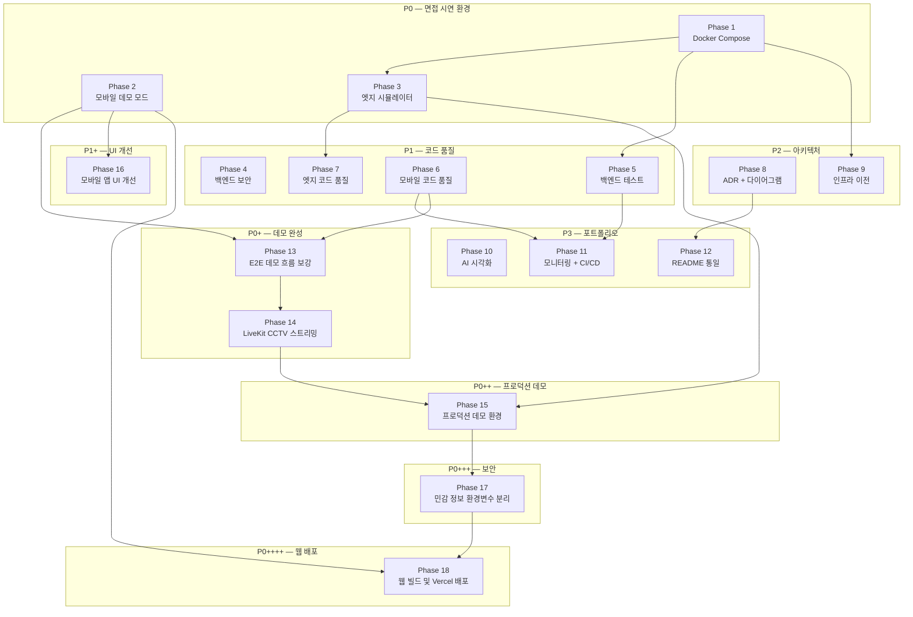

# Ember Sentinel — 개발 로드맵

> **기준 문서**: [PRD.md](./PRD.md) v1.0
> **최종 갱신일**: 2026-06-01 <!-- v4.2 T-085 웹 스크롤/잘림 수정 추가, Phase 18 완료 -->
> **목표**: 면접 시연 및 포트폴리오 활용을 위한 전체 시스템 개선 실행 계획

---

## 진행 상황 요약

| Phase | 이름                               | 우선순위 | 태스크 수 |  상태   |  진행률   |
| :---: | ---------------------------------- | :------: | :-------: | :-----: | :-------: |
|   1   | 로컬 개발 환경 (Docker Compose)    |    P0    |     6     | ✅ 완료 |    6/6    |
|   2   | 모바일 앱 데모 모드                |    P0    |     4     | ✅ 완료 |    4/4    |
|   3   | 엣지 IoT 시뮬레이터                |    P0    |     3     | ✅ 완료 |    3/3    |
|   4   | 백엔드 보안 강화                   |    P1    |     3     | ✅ 완료 |    3/3    |
|   5   | 백엔드 테스트 강화                 |    P1    |     4     | ✅ 완료 |    4/4    |
|   6   | 모바일 앱 코드 품질                |    P1    |     4     | ✅ 완료 |    4/4    |
|   7   | 엣지 IoT 코드 품질                 |    P1    |     3     | ✅ 완료 |    3/3    |
|   8   | 아키텍처 문서화 (ADR + 다이어그램) |    P2    |     4     | ✅ 완료 |    4/4    |
|   9   | 인프라 이전 및 비용 최적화         |    P2    |     3     | ✅ 완료 |    3/3    |
|  10   | AI 모델 시각화 및 실험             |    P3    |     4     | ✅ 완료 |    4/4    |
|  11   | 모니터링 및 CI/CD                  |    P3    |     6     | ✅ 완료 |    6/6    |
|  12   | 문서 및 README 통일                |    P3    |     3     | ✅ 완료 |    3/3    |
|  13   | E2E 데모 흐름 보강                 |    P0    |     3     | ✅ 완료 |    3/3    |
|  14   | LiveKit CCTV 실시간 스트리밍       |    P0    |     4     | ✅ 완료 |    4/4    |
|  15   | 프로덕션 데모 환경 구축            |    P0    |    16     | 🔄 진행 |   13/16   |
|  16   | 모바일 앱 UI 개선                  |    P1    |     3     | ✅ 완료 |    3/3    |
|  17   | 민감 정보 환경변수 분리            |    P0    |     8     | ✅ 완료 |    8/8    |
|  18   | 웹 빌드 및 Vercel 배포             |    P0    |     4     | ✅ 완료 |    4/4    |
|       | **합계**                           |          |  **85**   |         | **82/85** |

---

## Phase 1: 로컬 개발 환경 (Docker Compose)

> **PRD 섹션**: 3.1 | **우선순위**: P0 | **대상 레포**: `ember-sentinel-server`

**목표**: `docker compose up` 한 번으로 백엔드 전체 스택(PostgreSQL, Redis, LiveKit, MinIO, API 서버)을 기동하여 AWS 비용 없이 면접 시연 가능한 환경 구축

**선행 조건**: 없음

|  ID   | 태스크                              | 상태 | 비고                                                    |
| :---: | ----------------------------------- | :--: | ------------------------------------------------------- |
| T-001 | Docker Compose 파일 작성            |  ✅  | PostgreSQL, Redis, LiveKit, MinIO, API 서버 통합        |
| T-002 | `application-local.yml` 프로필 추가 |  ✅  | 로컬 Docker 환경용 설정. 의존: T-001                    |
| T-003 | DB 초기화 스크립트 작성             |  ✅  | `init.sql` — 테이블 생성 + 시드 데이터. 의존: T-001     |
| T-004 | LiveKit 로컬 설정                   |  ✅  | `livekit-local.yaml` — 로컬 API Key/Secret. 의존: T-001 |
| T-005 | MinIO 버킷 자동 생성                |  ✅  | `mc` CLI로 버킷 초기화. 의존: T-001                     |
| T-006 | 환경 변수 가이드 문서               |  ✅  | `.env.example` + 로컬 실행 가이드. 의존: T-001~T-005    |

**완료 기준**: `docker compose up` 후 3분 내 전체 서비스 정상 응답 (PRD 섹션 11)

---

## Phase 2: 모바일 앱 데모 모드 ✅

> **PRD 섹션**: 3.2 | **우선순위**: P0 | **대상 레포**: `ember-sentinel`

**목표**: 서버 연결 없이도 전체 화면 흐름 시연 가능. 서버 연결 시에는 실제 데이터로 동작.

**선행 조건**: 없음 (Phase 1과 병렬 진행 가능)

|  ID   | 태스크                   | 상태 | 비고                                                                                                                                                 |
| :---: | ------------------------ | :--: | ---------------------------------------------------------------------------------------------------------------------------------------------------- |
| T-007 | 데모 데이터 세트 확충    |  ✅  | `src/data/demoData.ts` — 인하대 캠퍼스 건물 5개, 방 7개, 카메라 14대, 멤버 28명, 화재 이벤트 12건. 서버 데이터 부족 시 자동 추가 프롬프트            |
| T-008 | API base URL 환경 변수화 |  ✅  | `EXPO_PUBLIC_API_BASE_URL` 환경 변수, `.env.example` 추가                                                                                            |
| T-009 | CCTV 화면 데모 영상      |  ✅  | `expo-av` Video 컴포넌트로 전환 (expo-video 시뮬레이터 미지원 해결), FireEventVideoScreen + CCTVLiveScreen 모두 fire-sample.mp4 + YOLO 오버레이 적용 |
| T-010 | 화재 이벤트 수동 트리거  |  ✅  | HomeScreen 시뮬레이션 버튼 + DEV 헬퍼 `simulateFire()`                                                                                               |

**완료 기준**: 서버 없이 9개 화면 모두 탐색 가능 (PRD 섹션 11)

---

## Phase 3: 엣지 IoT 시뮬레이터 ✅

> **PRD 섹션**: 3.3 | **우선순위**: P0 | **대상 레포**: `edge-IoT`

**목표**: 라즈베리파이 없이 노트북에서 엣지 디바이스 동작을 시뮬레이션

**선행 조건**: Phase 1 (T-001) — 시뮬레이터가 API 서버에 이벤트를 발행하려면 로컬 서버 필요

|  ID   | 태스크                   | 상태 | 비고                                                                      |
| :---: | ------------------------ | :--: | ------------------------------------------------------------------------- |
| T-011 | 엣지 시뮬레이터 스크립트 |  ✅  | `simulator.py` — 웹캠/샘플 영상으로 YOLO 추론 + API 호출. 의존: T-001     |
| T-012 | 설정 파일 외부화         |  ✅  | `config.yaml` + `config_loader.py`로 서버 URL, 모델 경로, BLE MAC 등 분리 |
| T-013 | BLE 모킹                 |  ✅  | `--no-ble` 플래그 + `MockBLEClient`로 BLE 없이 실행 가능. 의존: T-012     |

**완료 기준**: 엣지 시뮬레이터 → 푸시 알림 → 영상 확인까지 30초 내 (PRD 섹션 11)

---

## Phase 4: 백엔드 보안 강화 ✅

> **PRD 섹션**: 4.1 | **우선순위**: P1 | **대상 레포**: `ember-sentinel-server`

**목표**: 면접 예상 질문 "엣지 디바이스의 API 인증은 어떻게 처리하나요?"에 대한 답변 근거 마련

**선행 조건**: 없음 (Phase 1 완료 후 진행 권장)

|  ID   | 태스크                     | 상태 | 비고                                                                                       |
| :---: | -------------------------- | :--: | ------------------------------------------------------------------------------------------ |
| T-014 | 엣지 디바이스 API Key 인증 |  ✅  | `X-Device-API-Key` 헤더 검증, CameraEdge에 `api_key` 필드 추가, DeviceAuthInterceptor 신규 |
| T-015 | Rate Limiting 적용         |  ✅  | Redis INCR+EXPIRE 기반 디바이스별 1분 1회 제한, RateLimitService 신규. 의존: T-014         |
| T-016 | JWT Refresh Token 회전     |  ✅  | SHA-256 블랙리스트 기반 재사용 감지, 감지 시 전체 토큰 무효화 + 강제 재로그인              |

**완료 기준**: 인증 없는 `/embedded/fire-event/publish` 호출 시 401 반환, Rate Limit 초과 시 429 반환

---

## Phase 5: 백엔드 테스트 강화 ✅

> **PRD 섹션**: 4.2 | **우선순위**: P1 | **대상 레포**: `ember-sentinel-server`

**목표**: 면접 예상 질문 "테스트 전략은 어떻게 가져가셨나요?"에 대한 실질적 답변 근거

**선행 조건**: Phase 1 (T-001) — Testcontainers 통합 테스트에 Docker 환경 필요

|  ID   | 태스크                       | 상태 | 비고                                                                                 |
| :---: | ---------------------------- | :--: | ------------------------------------------------------------------------------------ |
| T-017 | 핵심 도메인 단위 테스트      |  ✅  | `FireEventCommandService`, `AuthService`, `RoomCommandService` 등 30개 테스트 클래스 |
| T-018 | 통합 테스트 (Testcontainers) |  ✅  | `@SpringBootTest` + Testcontainers (PostgreSQL, Redis). Docker 29.x 호환성 수정      |
| T-019 | API 엔드포인트 테스트        |  ✅  | MockMvc로 주요 API 성공/실패 케이스. 143개 테스트 전체 통과                          |
| T-020 | 테스트 커버리지 리포트       |  ✅  | JaCoCo 커버리지 78.7% 달성 (목표 70%). CI에 리포트 자동 생성 추가                    |

**완료 기준**: 백엔드 핵심 도메인 테스트 커버리지 70% 이상 (PRD 섹션 11)

---

## Phase 6: 모바일 앱 코드 품질 ✅

> **PRD 섹션**: 4.3 | **우선순위**: P1 | **대상 레포**: `ember-sentinel`

**목표**: JavaScript → TypeScript 전환 및 코드 품질 체계 구축

**선행 조건**: 없음 (Phase 2와 병렬 진행 가능하나, 충돌 방지를 위해 Phase 2 완료 후 권장)

|  ID   | 태스크                  | 상태 | 비고                                                                                                                                     |
| :---: | ----------------------- | :--: | ---------------------------------------------------------------------------------------------------------------------------------------- |
| T-021 | TypeScript 마이그레이션 |  ✅  | `.js` → `.tsx`/`.ts` 전환 완료. `src/types/index.ts` 도메인 타입 16개 정의, `tsconfig.json` strict 모드, `tsc --noEmit` 에러 0           |
| T-022 | API 에러 핸들링 통합    |  ✅  | `ApiError` 클래스 + `ApiErrorType` enum 8개 분류, 자동 토큰 갱신(401 → refresh → 재시도), 중복 갱신 방지. 의존: T-021                    |
| T-023 | 상태 관리 개선          |  ✅  | `AuthContext` + `useAuth()` 훅으로 인증 상태 중앙 관리. login/logout, FCM 토큰 초기화 통합. 의존: T-021                                  |
| T-024 | ESLint + Prettier 설정  |  ✅  | ESLint 10 (flat config) + Prettier 3.8 + Husky 9 + lint-staged 16. pre-commit 훅으로 자동 포맷/린트. ESLint 에러 0, 경고 53. 의존: T-021 |

**완료 기준**: 전체 `.js` 파일이 `.ts`/`.tsx`로 전환되고, ESLint/Prettier 통과

---

## Phase 7: 엣지 IoT 코드 품질 ✅

> **PRD 섹션**: 4.4 | **우선순위**: P1 | **대상 레포**: `edge-IoT`

**목표**: 하드코딩 제거 및 프로덕션급 에러 핸들링/로깅 체계 구축

**선행 조건**: Phase 3 (T-012) — 설정 파일 외부화가 하드코딩 제거의 기반

|  ID   | 태스크           | 상태 | 비고                                                                                                                      |
| :---: | ---------------- | :--: | ------------------------------------------------------------------------------------------------------------------------- |
| T-025 | 하드코딩 제거    |  ✅  | `client.py` IP/URL 하드코딩 제거, `config_loader` 통합. `main.py`/`simulator.py`는 Phase 3에서 완료. 의존: T-012          |
| T-026 | 에러 핸들링 강화 |  ✅  | 지수 백오프 재시도(`retry_sync`), 카메라 장애 복구(`recover_camera`), BLE/LiveKit 에러 세분화                             |
| T-027 | 로깅 체계 구축   |  ✅  | `logger.py` 모듈 신규 생성. `RotatingFileHandler` 5MB×3 로테이션, 레벨별(DEBUG~CRITICAL) 분리, `config.yaml` logging 섹션 |

**완료 기준**: `config.yaml` 수정만으로 환경 전환 가능, 에러 시 자동 복구 또는 로깅

---

## Phase 8: 아키텍처 문서화 (ADR + 다이어그램) ✅

> **PRD 섹션**: 5.2 + 5.3 | **우선순위**: P2 | **대상 레포**: `ember-sentinel` (docs/), `Terraform-Bastion-Server`

**목표**: 면접에서 "왜 이 기술을 선택했는가?"에 즉답 가능한 문서 체계 구축

**선행 조건**: 없음

|  ID   | 태스크                      | 상태 | 비고                                                                                                  |
| :---: | --------------------------- | :--: | ----------------------------------------------------------------------------------------------------- |
| T-031 | ADR 문서 8개 작성           |  ✅  | `docs/adr/` — SFU, YOLO, CQRS, RN, BLE, JWT, Terraform, Egress                                        |
| T-032 | 화재 감지 시퀀스 다이어그램 |  ✅  | Mermaid — 화재 감지 → 알림 → 스트리밍 전체 흐름 (`docs/diagrams/fire-detection-sequence.md`)          |
| T-033 | 인증 흐름 다이어그램        |  ✅  | Mermaid — 소셜 로그인 → JWT 발급 → 토큰 갱신 (`docs/diagrams/auth-flow-sequence.md`)                  |
| T-034 | 인프라 아키텍처 다이어그램  |  ✅  | Mermaid — AWS 리소스 관계도 + 보안 그룹 + 로컬 Docker + CI/CD (`docs/diagrams/infra-architecture.md`) |

**완료 기준**: ADR 8개 + 시퀀스 다이어그램 2개 + 인프라 다이어그램 1개 완성 (PRD 섹션 11)

---

## Phase 9: 인프라 이전 및 비용 최적화 ✅

> **PRD 섹션**: 5.1 | **우선순위**: P2 | **대상 레포**: `Terraform-Bastion-Server`, `ember-sentinel-server`

**목표**: 포트폴리오 시연용 상시 운영 환경을 최소 비용으로 유지 (권장: 로컬 Docker 기본, 필요 시 Railway/Render)

**선행 조건**: Phase 1 (T-001) — Docker 환경이 Railway/Render 배포의 기반

|  ID   | 태스크                   | 상태 | 비고                                                                                                                                                                                   |
| :---: | ------------------------ | :--: | -------------------------------------------------------------------------------------------------------------------------------------------------------------------------------------- |
| T-028 | Terraform 모듈 리팩토링  |  ✅  | 4개 모듈(networking/compute/database/storage) 분리, dev/prod 환경별 변수 분리, `default_tags` 비용 태그 5개 추가                                                                       |
| T-029 | 인프라 비용 분석 문서    |  ✅  | `docs/infra-cost-analysis.md` — AWS 월 ~$197 상세, 4가지 대안 비교, 3단계 운영 전략, 면접 Q&A 5개                                                                                      |
| T-030 | Railway/Render 배포 설정 |  ✅  | `Dockerfile.render` 멀티스테이지 빌드, `render.yaml` Blueprint, `railway.toml`, `application-render.yml` PaaS 프로필, LiveKit `@ConditionalOnProperty` 조건부 로딩 + `Optional<>` 주입 |

**완료 기준**: 비용 분석 문서 완성, Railway/Render 배포 설정으로 외부 데모 URL 확보 가능

---

## Phase 10: AI 모델 시각화 및 실험 ✅

> **PRD 섹션**: 6.1 | **우선순위**: P3 | **대상 레포**: `ember-sentinel-ai`

**목표**: AI 모델 학습 과정과 성능을 시각적으로 보여줄 수 있는 자료 생산

**선행 조건**: 없음

|  ID   | 태스크                    | 상태 | 비고                                                                                                                                            |
| :---: | ------------------------- | :--: | ----------------------------------------------------------------------------------------------------------------------------------------------- |
| T-035 | 학습 결과 시각화 대시보드 |  ✅  | 2x2 대시보드(Loss/mAP/Precision·Recall/LR) + 혼동 행렬 히트맵 + PR 곡선(fire AP=90.3%, smoke AP=83.9%) + Markdown 보고서                        |
| T-036 | 모델 비교 실험            |  ✅  | YOLOv11n(2.6M) vs YOLOv11s(9.4M) 비교, epoch별(10/20/30), imgsz별(320/480/640) 정확도-속도 트레이드오프 + 100ms 실시간 기준선 + Markdown 보고서 |
| T-037 | 데이터 증강 실험          |  ✅  | 5가지 증강 설정(Baseline→Mosaic→+Flip→+MixUp→All) 비교, 과도 증강 성능 하락 시각화, 델타 차트 + Markdown 보고서. 의존: T-036                    |
| T-038 | 추론 속도 벤치마크        |  ✅  | RPi5(78.5ms)/MacBook M2(12.3ms)/GPU(4.8ms)/RPi4(185ms) 파이프라인 스택 막대 + FPS 비교 + 10 FPS 기준선 + Markdown 보고서                        |

**완료 기준**: 모델 성능 시각화 자료 + 비교 실험 결과표 완성

**구현 내용**:

- `sim_data/` 패키지: ADR-002 기반 시뮬레이션 데이터 생성 (실제 학습 결과 존재 시 자동 전환)
- `visualize_training.py`, `visualize_comparison.py`, `visualize_augmentation.py`, `visualize_benchmark.py`
- `run_all_visualizations.py`: 전체 일괄 실행 → PNG 10개 + MD 보고서 4개 생성
- `requirements.txt`: matplotlib, pandas, tabulate 추가

---

## Phase 11: 모니터링 및 CI/CD

> **PRD 섹션**: 6.2 + 6.3 | **우선순위**: P3 | **대상 레포**: 전체

**목표**: 관측성 확보 및 전체 레포 CI/CD 파이프라인 통일

**선행 조건**: Phase 5 (T-017~T-019) — 백엔드 CI 개선에 테스트 필요, Phase 6 (T-021) — 모바일 CI에 TS 전환 필요

|  ID   | 태스크                      | 상태 | 비고                                                                                                |
| :---: | --------------------------- | :--: | --------------------------------------------------------------------------------------------------- |
| T-039 | Spring Boot Actuator 메트릭 |  ✅  | health, info, metrics, prometheus 엔드포인트 활성화, WebConfig actuator 경로 인증 제외              |
| T-040 | 구조화된 로깅               |  ✅  | logback-spring.xml (local=콘솔, dev/prod=JSON), RequestResponseLoggingFilter + FilterConfig         |
| T-041 | API 응답 시간 측정          |  ✅  | Micrometer 퍼센타일 히스토그램 (P50/P95/P99) + SLO (100ms/500ms/1s). 의존: T-039                    |
| T-042 | 모바일 앱 CI 추가           |  ✅  | GitHub Actions — ESLint + type-check + expo export web 빌드 검증. 의존: T-021                       |
| T-043 | 엣지 IoT CI 추가            |  ✅  | GitHub Actions — ruff check + mypy, pyproject.toml + requirements-dev.txt 추가                      |
| T-044 | 백엔드 CI 개선              |  ✅  | JaCoCo 커버리지 PR 코멘트 (madrapps/jacoco-report@v1.7), pull-requests 권한 추가. 의존: T-017~T-019 |

**완료 기준**: 전체 레포 CI 파이프라인 통과, Actuator 메트릭 엔드포인트 응답 확인

---

## Phase 12: 문서 및 README 통일 ✅

> **PRD 섹션**: 6.4 | **우선순위**: P3 | **대상 레포**: 전체

**목표**: GitHub 레포만으로 기술력을 보여줄 수 있는 수준의 문서 완성도 달성

**선행 조건**: Phase 8 (T-032) — 프로젝트 포털 README에 다이어그램 참조

|  ID   | 태스크                    | 상태 | 비고                                                                                                                          |
| :---: | ------------------------- | :--: | ----------------------------------------------------------------------------------------------------------------------------- |
| T-045 | 각 레포 README 통일       |  ✅  | 배지 7개(CI, 라이선스, React Native, Expo, Spring Boot, YOLOv11, Terraform), 설치 가이드, 아키텍처 요약, 프로젝트 구조 트리   |
| T-046 | 전체 프로젝트 포털 README |  ✅  | 5개 레포 관계도 Mermaid 다이어그램, 기술 스택 4카테고리 요약, ADR 8개 + 다이어그램 3개 링크, API 엔드포인트 요약. 의존: T-032 |
| T-047 | API 문서 정리             |  ✅  | Postman Collection v2.1 (6폴더 17 API), Swagger UI 접근 안내, Actuator 모니터링 엔드포인트 포함                               |

**완료 기준**: 5개 레포 README 형식 통일, Swagger UI 접근 가능, Postman Collection 제공

**구현 내용**:

- `README.md` 전면 개편: 프로젝트 포털 + 모바일 앱 통합 README
- 시스템 아키텍처 Mermaid 다이어그램 (Edge → Backend → Streaming → Mobile)
- 5개 레포 관계도 Mermaid 다이어그램 (데이터 흐름 시각화)
- `docs/api/ember-sentinel-api.postman_collection.json`: 6개 폴더(Auth, User, Room, Fire Event, Monitoring, LiveKit Webhook) 17개 API

---

## Phase 13: E2E 데모 흐름 보강 ✅

> **우선순위**: P0 | **대상 레포**: `ember-sentinel`

**목표**: 캡스톤 데모에서 로그인 → 푸시 알림 → CCTV 스트리밍까지 끊김 없는 E2E 흐름 확보

**선행 조건**: Phase 2 (T-010), Phase 6 (T-021~T-023)

|  ID   | 태스크                                    | 상태 | 비고                                                                                                                                                                      |
| :---: | ----------------------------------------- | :--: | ------------------------------------------------------------------------------------------------------------------------------------------------------------------------- |
| T-048 | 포그라운드 알림 배너 통합                 |  ✅  | `PushNotificationBanner`를 `App.tsx`에 렌더링, `currentNotification` 상태 + 5초 자동 닫기 타이머, 배너 탭 시 `FireAlertDetail` 자동 네비게이션                            |
| T-049 | 백그라운드 알림 탭 → 화면 자동 네비게이션 |  ✅  | `setupNotificationListeners`에 `onNotificationTapped` 콜백 분리, `getLastNotificationResponseAsync`로 cold start 처리, 서버 FCM 페이로드 + 로컬 시뮬레이션 알림 모두 파싱 |
| T-050 | LiveKit 스트리밍 토큰 API 클라이언트      |  ✅  | `api.ts`에 `getStreamSubscribeToken(fireEventId)`, `getFireEventRecordUrl(fireEventId)` 추가, `StreamTokenResponse`/`RecordUrlResponse` 인터페이스 정의                   |

**완료 기준**: 포그라운드 알림 배너 표시 + 배너/시스템 알림 탭 시 FireAlertDetail 자동 이동 + 스트리밍 API 호출 가능

**구현 내용**:

- `App.tsx`: `extractNavParamsFromNotification()` 함수로 서버 FCM 페이로드(`type`, `fireEventId`, `cameraId` 등) 및 로컬 시뮬레이션 알림 데이터를 통합 파싱
- `src/config/firebase.ts`: `setupNotificationListeners(onReceived, onTapped)` — 포그라운드 수신과 알림 탭을 독립 콜백으로 분리
- `src/config/api.ts`: `getStreamSubscribeToken()`, `getFireEventRecordUrl()` — LiveKit WebRTC 전체 통합 전 서버 연동 검증용 API 클라이언트

---

## Phase 14: LiveKit CCTV 실시간 스트리밍 ✅

> **우선순위**: P0 | **대상 레포**: `ember-sentinel`

**목표**: 기존 데모 전용 CCTV 화면(CCTVLiveScreen, FireEventVideoScreen)에 LiveKit WebRTC 실시간 스트리밍 + S3 녹화 영상 재생을 통합하되, 서버 연결 불가 시 기존 시뮬레이션으로 자동 폴백

**선행 조건**: Phase 13 (T-050) — LiveKit 스트리밍 API 클라이언트

|  ID   | 태스크                                     | 상태 | 비고                                                                                                                                                                                                                         |
| :---: | ------------------------------------------ | :--: | ---------------------------------------------------------------------------------------------------------------------------------------------------------------------------------------------------------------------------- |
| T-051 | LiveKit 패키지 설치 및 기반 설정           |  ✅  | `livekit-client`, `@livekit/react-native`, `@livekit/react-native-webrtc`, `@livekit/react-native-expo-plugin`, `@config-plugins/react-native-webrtc@13` 설치. `app.json` plugins 추가, `App.tsx`에 `registerGlobals()` 추가 |
| T-052 | useLiveKitStream 훅 + 컴포넌트 생성        |  ✅  | `useLiveKitStream.ts` — 7단계 상태 머신(idle→fetching_token→connecting→connected→streaming→reconnecting→error), 자동 재시도 3회, `LiveKitVideoView.tsx`, `ConnectionStatusOverlay.tsx` 신규 생성                             |
| T-053 | CCTVLiveScreen 실시간 스트리밍 통합        |  ✅  | 3단계 폴백 체인: LiveKit 스트리밍 → ConnectionStatusOverlay → 데모 방이면 DemoVideoFallback(fire-sample.mp4+YOLO 오버레이), 비데모면 CCTVSimulation. LIVE 배지 동적 색상(streaming: 초록, 그 외: 빨강)                       |
| T-054 | FireEventVideoScreen S3 Presigned URL 재생 |  ✅  | `getFireEventRecordUrl(fireEventId, roomId)` 비동기 로딩 → 3단계 폴백: S3 URL → 번들 샘플 영상(fire-sample.mp4 + YOLO 실시간 탐지 오버레이) → RecordedVideoSimulation. 동적 프로그레스 바(S3: 2:15 / 샘플: 0:06)             |

**완료 기준**: 실기기에서 LiveKit 퍼블리셔 연결 시 실시간 영상 수신, S3 녹화 URL로 재생, 서버 미연결 시 기존 시뮬레이션 정상 동작

**구현 내용**:

- `src/hooks/useLiveKitStream.ts`: LiveKit Room 연결 생명주기 전체 관리 (토큰 발급 → AudioSession → Room 생성 → 이벤트 리스너 → 연결 → 트랙 구독). LiveKit Cloud URL `<YOUR_LIVEKIT_URL>` 폴백
- `src/components/LiveKitVideoView.tsx`: `@livekit/react-native`의 `VideoView` 래퍼 (deprecated API이나 `@livekit/components-react` 의존 없이 동작)
- `src/components/ConnectionStatusOverlay.tsx`: 상태별 UI (로딩 인디케이터 + 메시지 / 에러 + "다시 시도" 버튼)
- `src/screens/CCTVLiveScreen.tsx`: LiveKit 3단계 폴백 체인 + 데모 방 판별(isDemoRoomId) → DemoVideoFallback(fire-sample.mp4 + YOLO 탐지 오버레이 + HUD) / CCTVSimulation 분기
- `src/screens/FireEventVideoScreen.tsx`: S3 URL 비동기 페칭 + S3VideoPlayer 내부 컴포넌트 추가

**네이티브 빌드 필요**: LiveKit WebRTC는 Expo Go에서 동작하지 않으므로 `eas build --profile development --platform all` 필수

---

## Phase 15: 프로덕션 데모 환경 구축

> **우선순위**: P0 | **대상 레포**: 크로스 레포 (ember-sentinel, edge-IoT, ember-sentinel-server)

**목표**: 면접/취업 준비를 위해 전체 시스템이 실제로 E2E 동작하는 상태를 만들고, 이를 증명하는 데모 자료(GIF/스크린샷) 확보

**선행 조건**: Phase 14 (T-051~T-054) — LiveKit WebRTC 코드 완성

> 📋 **상세 실행 가이드**: [phase15-execution-guide.md](./phase15-execution-guide.md) — 각 태스크의 구체적 실행 절차, 커맨드, 리스크 대응

### 영역 1: 엣지 대체 — 노트북 웹캠 시뮬레이터 (edge-IoT 레포)

|  ID   | 태스크                                        | 상태 | 비고                                                                                                                                            |
| :---: | --------------------------------------------- | :--: | ----------------------------------------------------------------------------------------------------------------------------------------------- |
| T-055 | YOLO 모델 준비 및 macOS 호환 검증             |  ✅  | macOS에서 `.pt` 모델 직접 사용, LiveKit Python SDK ARM64 호환성 확인                                                                            |
| T-056 | config.production.yaml 프로덕션 프로필 추가   |  ✅  | EC2 API URL + LiveKit Cloud URL + 디바이스 UUID/API Key 반영 완료                                                                               |
| T-057 | macOS 웹캠 시뮬레이터 실행 가이드 작성        |  ✅  | `docs/macos-simulator-guide.md` — 환경 설정, 실행법, E2E 검증 결과 포함                                                                         |
| T-058 | 샘플 화재 영상 준비 (웹캠 없이도 테스트 가능) |  ✅  | fire-sample.mp4 (6초, 1.9MB) YOLO best.pt로 144프레임 추론 → 바운딩 박스 내장 영상으로 교체 (ffmpeg H.264 재인코딩), 클라이언트 오버레이 불필요 |

### 영역 2: EAS Build 실기기 배포 (ember-sentinel 레포)

|  ID   | 태스크                                     | 상태 | 비고                                                                                     |
| :---: | ------------------------------------------ | :--: | ---------------------------------------------------------------------------------------- |
| T-059 | eas.json 환경변수 + APK 빌드 설정          |  ✅  | preview 프로필에 `buildType: apk` + `EXPO_PUBLIC_API_BASE_URL` 환경변수 추가             |
| T-060 | google-services.json 및 EAS Secrets 준비   |  ✅  | Firebase Console에서 다운로드 → 프로젝트 루트 배치 완료                                  |
| T-061 | EAS Build Android APK 빌드 및 실기기 설치  |  ✅  | preview APK 빌드 완료, GitHub Releases 배포 + README 다운로드 섹션 추가                  |
| T-062 | iOS 시뮬레이터 빌드 배포 (TestFlight 대체) |  ✅  | Apple Developer 미가입 → 시뮬레이터 .app zip 배포로 대체. README에 배포/설치 가이드 추가 |

### 영역 3: E2E 동작 검증 (크로스 레포)

|  ID   | 태스크                                          | 상태 | 비고                                                          |
| :---: | ----------------------------------------------- | :--: | ------------------------------------------------------------- |
| T-063 | 백엔드에 시뮬레이터용 카메라 디바이스 등록      |  ✅  | UUID: bb4086d6-..., API Key: c32c2b36-..., Room ID: 1         |
| T-064 | 실시간 스트리밍 E2E 검증                        |  ✅  | 스트리밍 토큰 발급 + LiveKit Cloud 접근 검증 스크립트 완료    |
| T-065 | Egress 녹화 → S3 → Presigned URL → 앱 재생 검증 |  ✅  | S3 Presigned URL HEAD 검증 + Content-Type/크기 확인 자동화    |
| T-066 | FCM 푸시 알림 실기기 E2E 검증                   |  ✅  | 화재 이벤트 발행 + FCM 수신 체크리스트 + 전체 E2E 플로우 통합 |

### 영역 4: 데모 GIF/스크린샷 (ember-sentinel 레포)

|  ID   | 태스크                              | 상태 | 비고                                                       |
| :---: | ----------------------------------- | :--: | ---------------------------------------------------------- |
| T-067 | 실기기에서 9개 화면 스크린샷 캡처   |  ⬜  | scrcpy/ADB로 실기기 화면 캡처 → docs/screenshots/ 교체     |
| T-068 | 핵심 플로우 GIF 3개 녹화            |  ⬜  | 화재 감지→알림, CCTV 스트리밍, 녹화 재생 (scrcpy + ffmpeg) |
| T-069 | README 데모 섹션 업데이트           |  ✅  | E2E 데모 GIF 3개 참조, 동작 검증 시나리오 표시             |
| T-070 | 전체 프로젝트 포털 README 데모 보강 |  ⬜  | 실제 동작 GIF로 교체, P2 우선순위                          |

### 완료 기준

모든 작업 완료 후 아래 시나리오가 E2E로 동작해야 함:

1. macOS에서 시뮬레이터 실행 → 화재 감지
2. 실기기(Android)에서 FCM 푸시 알림 수신
3. 알림 탭 → CCTVLiveScreen에서 실시간 영상 확인
4. 스트리밍 종료 후 FireEventHistory → 녹화 영상 재생
5. 이 전체 플로우가 GIF로 캡처되어 README에 표시

---

## Phase 16: 모바일 앱 UI 개선 ✅

> **우선순위**: P1 | **대상 레포**: `ember-sentinel`

**목표**: FireLocationScreen 건물 평면도의 화재 위치 미표시 버그 3건 수정 + 실제 건물 느낌의 평면도 UI로 전면 개선

**선행 조건**: Phase 2 (T-007) — 데모 데이터 기반

|  ID   | 태스크                            | 상태 | 비고                                                                                                                                                                                                                                                            |
| :---: | --------------------------------- | :--: | --------------------------------------------------------------------------------------------------------------------------------------------------------------------------------------------------------------------------------------------------------------- |
| T-071 | 층/방 유틸리티 + 데모 데이터 헬퍼 |  ✅  | `floorUtils.ts` — 층 파싱(parseFloor: 'B1F'→{sortKey:-1}), B1~12층 목록 생성, 층당 12개 방 생성(모든 방 hasFire 비교), 위험도/대피방향 판별. `demoData.ts`에 `getDemoRoomsForFloor()` 헬퍼 추가                                                                 |
| T-072 | 평면도 서브컴포넌트 4개 생성      |  ✅  | `FloorSelector.tsx`(B1~12층 가로 스크롤 + 화재층 빨간 인디케이터), `RoomCell.tsx`(크기 차별화 + 카메라 태그 + 위험도 바 + 화재 펄스 애니메이션), `FloorPlanView.tsx`(외벽/계단/E·V/비상구 View 기반 레이아웃), `EvacuationOverlay.tsx`(대피 방향 화살표 + 범례) |
| T-073 | FireLocationScreen 전면 리팩터링  |  ✅  | 서브컴포넌트 조합 구조로 전환, useMemo 파생 데이터 최적화, 대피 경로 토글 버튼, 화재 알림 카드(감지 카메라 상세), 범례 카드. 버그 3건 수정: (1) hasFire 모든 방 비교, (2) 상단 행 화재 스타일 적용, (3) 지하층 파싱 정상화                                      |

**완료 기준**: 데모 모드에서 501호/302호/B103호 진입 시 🔥 마커 정상 표시, B1~12층 전체 탐색 가능, 카메라/비상구/위험도 시각 확인

**구현 내용**:

- `src/utils/floorUtils.ts`: FloorInfo/FloorRoom/FloorLayout 타입 + parseFloor(정규식 기반) + generateFloorList(B1~12층 13개) + generateRoomsForFloor(12개 방, 크기 차별화) + getRiskColor + getEvacuationDirection
- `src/data/demoData.ts`: getDemoRoomsForFloor(층별 카메라 수/화재 방 조회)
- `src/components/floor-plan/FloorSelector.tsx`: useRef 자동 스크롤, 화재층 빨간 점 + 어두운 배경 인디케이터
- `src/components/floor-plan/RoomCell.tsx`: Animated.View 펄스(0.6~1.0 opacity), flex 비율(large:1.5/normal:1/small:0.8), 위험도 컬러 바
- `src/components/floor-plan/FloorPlanView.tsx`: 외벽(#8B7355 3px) + 내부(#E8E0D4) + 계단실/엘리베이터/복도 + 비상구 2개
- `src/components/floor-plan/EvacuationOverlay.tsx`: 화재 위치 기반 대피 방향(left/right/both) + EXIT 화살표 + 3색 범례
- `src/screens/FireLocationScreen.tsx`: 300줄→250줄, 인라인 로직 → 유틸/컴포넌트 분리, ScrollView 세로 스크롤

---

## Phase 17: 민감 정보 환경변수 분리 ✅

> **우선순위**: P0 | **대상 레포**: `ember-sentinel` (주), `edge-IoT` (문서만)

**목표**: 공개 Git 레포에 하드코딩된 Firebase 설정, 소셜 로그인 키, EC2 IP 주소, LiveKit URL을 환경변수로 분리하여 `.env`(gitignored)에서만 실제 값을 관리하도록 전환

**선행 조건**: Phase 15 (T-059) — eas.json 환경변수 설정

|  ID   | 태스크                            | 상태 | 비고                                                                                                                                                                      |
| :---: | --------------------------------- | :--: | ------------------------------------------------------------------------------------------------------------------------------------------------------------------------- |
| T-074 | `.env` + `.env.example` 설정      |  ✅  | `.env.example` 플레이스홀더 템플릿 신규 생성, `.env` 실제 값 (gitignored). Firebase/Google/Kakao/Server/LiveKit 총 13개 환경변수                                          |
| T-075 | `app.json` → `app.config.ts` 전환 |  ✅  | `app.json` 삭제, `app.config.ts`로 전환. Kakao/Google 키를 `process.env.*`로 동적 참조. 플러그인 설정(`@react-native-kakao/core`, CFBundleURLSchemes, intentFilters) 연동 |
| T-076 | 소스 코드 환경변수 참조로 변경    |  ✅  | `firebase.ts` Firebase 설정 7개, `socialLogin.ts` Google/Kakao 키 4개, `api.ts` API URL 폴백 `localhost`로 변경, `useLiveKitStream.ts` LiveKit URL 환경변수 참조          |
| T-077 | `eas.json` 하드코딩 env 블록 제거 |  ✅  | development/preview/production 3개 프로필에서 `EXPO_PUBLIC_API_BASE_URL` 하드코딩 제거 → EAS Secrets로 이동                                                               |
| T-078 | 네이티브 설정 파일 IP/키 제거     |  ✅  | `network_security_config.xml`에서 EC2 IP 제거(localhost/에뮬레이터 유지), `Info.plist`에서 IP 도메인·KAKAO_APP_KEY 값·Google/Kakao URL Schemes 제거                       |
| T-079 | 스크립트 IP 제거                  |  ✅  | `e2e-verify.sh` API_BASE를 `${EMBER_API_BASE:-http://localhost:8080}`으로 변경                                                                                            |
| T-080 | 문서 플레이스홀더 교체            |  ✅  | ROADMAP.md, phase15-execution-guide.md, eas-build-guide.md, CLAUDE.md, infra-cost-analysis.md에서 EC2 IP → `<YOUR_SERVER_IP>`, LiveKit URL → `<YOUR_LIVEKIT_URL>` 교체    |
| T-081 | git history 민감정보 정리         |  ✅  | `git-filter-repo --replace-text`로 `ember-sentinel`·`edge-IoT` 2개 레포 전체 히스토리 치환 + force push. 키 로테이션은 별도 진행 예정                                     |

**완료 기준**: `grep -r "<실제IP>" --include="*.ts" --include="*.json" --include="*.xml" --include="*.plist" .` → 0건, `grep -r "<실제Firebase키>" --include="*.ts" .` → 0건

**구현 내용**:

- `.env.example`: 13개 환경변수 플레이스홀더 (Firebase 7개, Google OAuth 3개, Kakao 1개, Server 1개, LiveKit 1개)
- `app.config.ts`: `ExpoConfig` 타입 export, `process.env.EXPO_PUBLIC_KAKAO_APP_KEY` / `GOOGLE_IOS_CLIENT_ID` / `GOOGLE_ANDROID_CLIENT_ID`로 동적 참조
- `src/config/firebase.ts`: 하드코딩된 API Key/Auth Domain/Project ID/Storage Bucket/Sender ID/App ID/Measurement ID 제거
- `src/config/socialLogin.ts`: Google Web/iOS/Android Client ID + Kakao App Key 환경변수 참조
- `src/config/api.ts`: 폴백 URL `http://localhost:8080`으로 변경 (실제 IP 제거)
- `src/hooks/useLiveKitStream.ts`: LiveKit Cloud URL 환경변수 참조
- `eas.json`: 3개 프로필 env 블록 제거
- `ios/EmberSentinel/Info.plist`: NSExceptionDomains IP 제거, CFBundleURLTypes 비움, KAKAO_APP_KEY 비움 (prebuild 시 `app.config.ts`에서 자동 주입)
- `android/.../network_security_config.xml`: EC2 IP 도메인 제거
- 문서 5개 파일: 14건 IP + 6건 LiveKit URL 플레이스홀더 교체

**EAS Secrets 설정** (별도 CLI 실행 필요):

```bash
eas secret:create --name EXPO_PUBLIC_API_BASE_URL --value "http://<YOUR_SERVER_IP>:8080" --scope project
eas secret:create --name EXPO_PUBLIC_LIVEKIT_URL --value "wss://<YOUR_LIVEKIT_URL>" --scope project
# Firebase/Google/Kakao 키도 동일하게 등록
```

---

## Phase 18: 웹 빌드 및 Vercel 배포

> **우선순위**: P0 | **대상 레포**: `ember-sentinel`

**목표**: 면접관이 iOS Safari에서 URL만 열어 앱을 즉시 체험할 수 있도록 웹 빌드를 만들고 Vercel에 배포. 네이티브 전용 기능은 웹에서 우아하게 비활성화하고 데모 모드로 전체 앱을 체험 가능하게 한다.

**선행 조건**: Phase 2 (데모 모드), Phase 17 (환경변수 분리)

> **v4.1 계획 검증 결과**: 원래 8개 태스크(T-082~T-089)에서 과잉 작업 5개를 삭제/통합하여 3개로 압축.
>
> - T-082~T-084 (expo-notifications 웹 호환): **삭제** — expo-notifications가 이미 웹 지원, 모든 호출이 try-catch 내부
> - T-085 (App.tsx 웹 분기): **축소** → T-082에 통합 (`.catch(() => null)` 1줄 추가)
> - T-088 (로컬 빌드 테스트): T-084에 통합

|  ID   | 태스크                                                               | 상태 | 비고                                                                                                                                                                                                                          |
| :---: | -------------------------------------------------------------------- | :--: | ----------------------------------------------------------------------------------------------------------------------------------------------------------------------------------------------------------------------------- |
| T-082 | LoginScreen 소셜 로그인 동적 require + 웹 분기 + App.tsx .catch 추가 |  ✅  | Google/Kakao 정적 import → `getNativeAuthModules()` 동적 require, 웹에서 소셜 버튼 숨김 + "웹 데모 버전" 배너, App.tsx `getLastNotificationResponseAsync().catch(() => null)`                                                 |
| T-083 | webAlert.ts 유틸 + 핵심 Alert 웹 호환 교체                           |  ✅  | `confirmAlert()`/`infoAlert()` 유틸(웹: `window.confirm`/`alert`, 네이티브: `Alert.alert`), LoginScreen/HomeScreen/RoomDetailScreen 데모 핵심 흐름 Alert 교체                                                                 |
| T-084 | vercel.json 생성 + 로컬 검증 + Vercel 배포                           |  ✅  | `expo export --platform web` → Vercel 정적 배포, SPA rewrites, Vercel 프로덕션 배포 완료 → https://ember-sentinel-jeffkms-projects.vercel.app                                                                                 |
| T-085 | 웹 스크롤 차단 해제 + 화면 잘림 수정 + 데스크톱 maxWidth             |  ✅  | Expo 기본 CSS(`overflow:hidden`) 오버라이드, CCTV/영상 화면 ScrollView 래핑 + 웹 고정 높이, 데스크톱 `maxWidth:480` 중앙 정렬. 수정: App.tsx, CCTVLiveScreen, FireEventVideoScreen, LoginScreen, HomeScreen, RoomDetailScreen |

**완료 기준**: iOS Safari에서 배포된 URL 접속 → 데모 모드로 로그인 → 9개 화면 전체 탐색 가능, 네이티브 빌드 회귀 없음

**수정 파일 목록**:

| 순서 | 파일                                   | 변경                                           | 위험도 |
| :--: | -------------------------------------- | ---------------------------------------------- | :----: |
|  1   | `src/screens/LoginScreen.tsx`          | 소셜 SDK 동적 require + 웹 분기 + 웹 배너      |  중간  |
|  2   | `src/utils/webAlert.ts`                | **신규** — 웹 호환 Alert 유틸                  |  낮음  |
|  3   | `App.tsx`                              | `getLastNotificationResponseAsync` .catch 추가 |  낮음  |
|  4   | `src/screens/HomeScreen.tsx`           | 핵심 Alert → webAlert 교체 (삭제/로그아웃)     |  낮음  |
|  5   | `src/screens/RoomDetailScreen.tsx`     | 핵심 Alert → webAlert 교체 (삭제 확인)         |  낮음  |
|  6   | `vercel.json`                          | **신규** — Vercel 배포 설정                    |  낮음  |
|  7   | `App.tsx`                              | 웹 CSS 오버라이드 + 데스크톱 maxWidth 480      |  낮음  |
|  8   | `src/screens/CCTVLiveScreen.tsx`       | ScrollView 래핑 + videoContainer 웹 고정 높이  |  낮음  |
|  9   | `src/screens/FireEventVideoScreen.tsx` | ScrollView 래핑 + videoContainer 웹 고정 높이  |  낮음  |

---

## Phase 의존성 그래프



### 태스크 수준 핵심 의존성

```
T-001 ──┬── T-002, T-003, T-004, T-005
        ├── T-006 (T-001~T-005 모두 완료 후)
        ├── T-011 (엣지 시뮬레이터 → 로컬 서버 필요)
        ├── T-018 (Testcontainers → Docker 환경)
        └── T-030 (Railway/Render → Dockerfile 기반)

T-007 ── T-010 (데모 데이터 → 수동 트리거)

T-012 ──┬── T-013 (설정 외부화 → BLE 모킹)
        └── T-025 (설정 외부화 → 하드코딩 제거)

T-014 ── T-015 (API Key 인증 → Rate Limiting)

T-017 ──┬── T-019 (단위 테스트 → API 테스트)
        └── T-020 (T-017~T-019 → 커버리지 리포트)

T-021 ──┬── T-022 (TS 전환 → 에러 핸들링)
        ├── T-023 (TS 전환 → 상태 관리)
        ├── T-024 (TS 전환 → ESLint/Prettier)
        └── T-042 (TS 전환 → 모바일 CI)

T-036 ── T-037 (모델 비교 → 데이터 증강 실험)
T-039 ── T-041 (Actuator → 응답 시간 측정)
T-032 ── T-046 (시퀀스 다이어그램 → 포털 README)
T-017~T-019 ── T-044 (백엔드 테스트 → 백엔드 CI 개선)

T-010 ── T-048 (화재 수동 트리거 → 포그라운드 배너 통합)
T-023 ──┬── T-048 (상태 관리 → 배너 상태)
        └── T-049 (상태 관리 → 알림 탭 네비게이션)
T-009 ── T-050 (CCTV 데모 영상 → 스트리밍 API 클라이언트)

T-050 ──┬── T-051 (스트리밍 API → LiveKit 패키지 설치)
        └── T-052 (스트리밍 API → useLiveKitStream 훅)
T-052 ──┬── T-053 (훅/컴포넌트 → CCTVLiveScreen 통합)
        └── T-054 (훅/API → FireEventVideoScreen S3 재생)

T-054 ── T-055 (LiveKit 코드 완성 → macOS 시뮬레이터 호환 검증)
T-055 ── T-056 (모델 준비 → 프로덕션 설정)
T-056 ── T-064 (설정 완료 → E2E 스트리밍 검증)
T-059 ── T-061 (빌드 설정 → APK 빌드)
T-060 ── T-061 (Firebase 설정 → APK 빌드)
T-061 ──┬── T-064 (실기기 → 스트리밍 검증)
        ├── T-065 (실기기 → 녹화 재생 검증)
        └── T-066 (실기기 → 푸시 알림 검증)
T-064 ── T-068 (E2E 동작 → GIF 캡처)
T-067 ── T-069 (스크린샷 → README 업데이트)
T-068 ── T-069 (GIF → README 업데이트)

T-007 ── T-071 (데모 데이터 → 층/방 유틸리티)
T-071 ── T-072 (유틸리티 → 평면도 서브컴포넌트)
T-072 ── T-073 (서브컴포넌트 → 화면 리팩터링)

T-059 ── T-074 (eas.json 환경변수 → .env 설정)
T-074 ── T-075 (환경변수 정의 → app.config.ts 전환)
T-074 ── T-076 (환경변수 정의 → 소스 코드 참조 변경)
T-075 ── T-078 (app.config.ts → 네이티브 설정 정리)
T-076 ── T-077 (소스 코드 변경 → eas.json 정리)
T-078 ── T-080 (네이티브 설정 → 문서 플레이스홀더)
T-079 ── T-080 (스크립트 정리 → 문서 플레이스홀더)

T-082 ── T-083 (소셜 로그인 웹 분기 → Alert 웹 호환 교체)
T-082~T-083 ── T-084 (웹 호환 코드 → 로컬 검증 + Vercel 배포)
T-084 ── T-085 (Vercel 배포 → 웹 스크롤/잘림 수정)
```

---

## 면접 시연 준비 체크리스트

> PRD 섹션 7 기반 — 3가지 시나리오를 모두 중단 없이 실행할 수 있어야 성공

### 시나리오 1: 전체 E2E 데모 — 실기기 (10분) [Phase 15]

- [ ] EC2 백엔드 서버 가동 확인 (`<YOUR_SERVER_IP>:8080`)
- [ ] macOS 웹캠 시뮬레이터 실행 준비 (T-055, T-056)
- [ ] Android 실기기에서 APK 설치 및 앱 실행 (T-061)
- [ ] 소셜 로그인 시연 (Google/Kakao)
- [ ] 홈 화면에서 서버 Room 목록 확인
- [ ] 시뮬레이터에서 화재 감지 트리거 → 실기기 FCM 알림 수신 (T-066)
- [ ] 알림 탭 → CCTV 실시간 WebRTC 영상 시청 (T-064)
- [ ] 스트리밍 종료 → 녹화 영상 S3 재생 (T-065)
- [ ] 아키텍처 다이어그램으로 시스템 설명 (Phase 8)

### 시나리오 2: 웹 데모 — iOS Safari URL 접속 (5분) [Phase 18]

- [ ] Vercel 배포 URL을 iOS Safari에서 접속 (T-089)
- [ ] 로그인 화면 정상 표시 (crash 없음)
- [ ] "관리자" 역할 데모 로그인으로 진입
- [ ] Home 화면 데모 데이터 표시
- [ ] RoomDetail 화면 진입 및 표시
- [ ] FireAlertDetail 화면 진입
- [ ] CCTVLive 화면 (시뮬레이션 or 폴백 표시)
- [ ] FireLocation 평면도 표시
- [ ] FireEventHistory 목록 표시
- [ ] FireEventVideo 영상 재생 or 시뮬레이션 표시
- [ ] 로그아웃 동작 정상

### 시나리오 3: 오프라인 데모 (5분)

- [ ] 모바일 앱 데모 모드 실행 — 서버 불필요 (Phase 2)
- [ ] 샘플 데이터로 전체 화면 흐름 시연 (9개 화면)
- [ ] "화재 감지 시뮬레이션" 버튼으로 알림 흐름 시연 (T-010)
- [ ] 아키텍처 다이어그램 + ADR로 기술 선택 설명 (Phase 8)

### 시나리오 4: 코드 워크스루 (15분)

- [ ] 시스템 아키텍처 다이어그램으로 전체 구조 설명 (T-034)
- [ ] 화재 감지 플로우: edge-IoT → API → FCM → 모바일 앱 (T-032)
- [ ] CQRS 패턴: Command/Query 분리 구조 코드 리뷰
- [ ] YOLO 모델 학습 파이프라인 + 성능 메트릭 설명 (Phase 10)
- [ ] Terraform IaC: 인프라 구성 코드 리뷰 (T-028)
- [ ] 테스트 전략 설명 + 테스트 실행 시연 (Phase 5)

---

## 변경 이력

| 날짜       | 버전 | 변경 내용                                                                                                                                                                                                                                                                                                                                                                                                                                                                                                                                                                                                                                |
| ---------- | :--: | ---------------------------------------------------------------------------------------------------------------------------------------------------------------------------------------------------------------------------------------------------------------------------------------------------------------------------------------------------------------------------------------------------------------------------------------------------------------------------------------------------------------------------------------------------------------------------------------------------------------------------------------- |
| 2026-05-20 | v1.0 | PRD v1.0 기반 초기 로드맵 작성 (47개 태스크, 12개 Phase)                                                                                                                                                                                                                                                                                                                                                                                                                                                                                                                                                                                 |
| 2026-05-21 | v1.1 | Phase 2 완료 (T-007~T-010) — 모바일 앱 데모 모드 구현                                                                                                                                                                                                                                                                                                                                                                                                                                                                                                                                                                                    |
| 2026-05-21 | v1.2 | Phase 3 완료 (T-011~T-013) — 엣지 IoT 시뮬레이터 구현                                                                                                                                                                                                                                                                                                                                                                                                                                                                                                                                                                                    |
| 2026-05-21 | v1.3 | Phase 4 완료 (T-014~T-016) — 백엔드 보안 강화: API Key 인증, Rate Limiting, Refresh Token 회전 개선                                                                                                                                                                                                                                                                                                                                                                                                                                                                                                                                      |
| 2026-05-21 | v1.4 | Phase 5 완료 (T-017~T-020) — 백엔드 테스트 강화: 143개 테스트 전체 통과, JaCoCo 커버리지 78.7%                                                                                                                                                                                                                                                                                                                                                                                                                                                                                                                                           |
| 2026-05-21 | v1.5 | Phase 6 완료 (T-021~T-024) — 모바일 앱 코드 품질: JS→TS 전환, ApiError 에러 체계, AuthContext 상태 관리, ESLint+Prettier+Husky                                                                                                                                                                                                                                                                                                                                                                                                                                                                                                           |
| 2026-05-21 | v1.6 | Phase 7 완료 (T-025~T-027) — 엣지 IoT 코드 품질: client.py 하드코딩 제거, 지수 백오프 재시도+카메라 복구, logging 모듈+파일 로테이션                                                                                                                                                                                                                                                                                                                                                                                                                                                                                                     |
| 2026-05-21 | v1.7 | Phase 8 완료 (T-031~T-034) — 아키텍처 문서화: ADR 8개(SFU, YOLO, CQRS, RN, BLE, JWT, Terraform, Egress) + Mermaid 시퀀스 다이어그램 2개 + 인프라 아키텍처 다이어그램 1개                                                                                                                                                                                                                                                                                                                                                                                                                                                                 |
| 2026-05-21 | v1.8 | Phase 9 완료 (T-028~T-030) — 인프라 이전 및 비용 최적화: Terraform 4모듈 리팩토링(networking/compute/database/storage) + dev/prod 환경 분리, AWS 비용 분석($197/월 상세) + 4대안 비교 + 3단계 운영 전략, Render/Railway PaaS 배포(Dockerfile.render 멀티스테이지 + render.yaml Blueprint + LiveKit @ConditionalOnProperty 조건부 로딩)                                                                                                                                                                                                                                                                                                   |
| 2026-05-21 | v1.9 | Phase 10 완료 (T-035~T-038) — AI 모델 시각화 및 실험: sim_data 시뮬레이션 패키지(실제 데이터 자동 전환), 학습 대시보드(Loss/mAP/CM/PR), 모델 비교(n vs s + epoch + imgsz 트레이드오프), 증강 실험(5설정 비교 + 과도 증강 하락), 추론 벤치마크(4디바이스 파이프라인 분해 + FPS) → PNG 10개 + MD 보고서 4개                                                                                                                                                                                                                                                                                                                                |
| 2026-05-21 | v2.0 | Phase 11 완료 (T-039~T-044) — 모니터링 및 CI/CD: Actuator 메트릭(health/info/metrics/prometheus) + Micrometer 퍼센타일(P50/P95/P99), logback-spring.xml JSON 구조화 로깅(프로필별 분리) + RequestResponseLoggingFilter, 모바일 CI(ESLint+TS+expo export), 엣지 CI(ruff+mypy), 백엔드 CI JaCoCo PR 코멘트                                                                                                                                                                                                                                                                                                                                 |
| 2026-05-21 | v2.1 | Phase 12 완료 (T-045~T-047) — 문서 및 README 통일: README.md 전면 개편(배지 7개 + 시스템 아키텍처 Mermaid + 5개 레포 관계도 + 기술 스택 4카테고리 + 9화면 상세 + ADR/다이어그램 링크), Postman Collection v2.1(6폴더 17 API + Actuator 모니터링), **전체 로드맵 47/47 태스크 완료** 🎉                                                                                                                                                                                                                                                                                                                                                   |
| 2026-05-21 | v2.2 | 데모 모드 품질 보강 — T-007: 데모 데이터 305호 화재 위치 통일(홈/구역상세/CCTV/평면도 일관성 확보), 오프라인 모드 레이스 컨디션 수정(offlineModeChecked 플래그). T-009: CCTV 시뮬레이션 UI 전면 개선(실내 배경+서버랙/테이블/모니터+불꽃 파티클 10개+연기 파티클 7개+천장 연기+YOLO 바운딩 박스 애니메이션), CCTVParticles.tsx 공유 컴포넌트 분리, FireEventVideoScreen 동일 적용. T-046: README 데모 영상 섹션 추가(docs/demos/ 4개 GIF 플레이스홀더, 녹화 가이드)                                                                                                                                                                      |
| 2026-05-22 | v2.3 | EC2 서버 마이그레이션 — 새 AWS 계정(Free Tier) t3.micro EC2(ap-southeast-2, <YOUR_SERVER_IP>) + RDS db.t4g.micro PostgreSQL 구축, Docker Redis 7-alpine 설치, LiveKit Cloud 전환(<YOUR_LIVEKIT_URL>), Spring Boot JAR 로컬 빌드→SCP 배포, 모바일 앱 API URL 업데이트(api.ts, Info.plist ATS, network_security_config.xml)                                                                                                                                                                                                                                                                                                                |
| 2026-05-22 | v2.4 | Phase 13 추가 (T-048~T-050) — E2E 데모 흐름 보강: PushNotificationBanner App.tsx 통합(포그라운드 알림 배너 + 5초 자동 닫기), setupNotificationListeners onNotificationTapped 콜백 분리 + cold start(getLastNotificationResponseAsync) 처리, 서버 FCM 페이로드 파싱(extractNavParamsFromNotification), LiveKit 스트리밍 API 클라이언트(getStreamSubscribeToken + getFireEventRecordUrl) 추가. **50/50 태스크 완료**                                                                                                                                                                                                                       |
| 2026-05-22 | v2.5 | Phase 14 추가 (T-051~T-054) — LiveKit CCTV 실시간 스트리밍: LiveKit 5개 패키지 설치 + app.json plugins + registerGlobals(), useLiveKitStream 훅(7단계 상태 머신 + 자동 재시도 3회) + LiveKitVideoView + ConnectionStatusOverlay, CCTVLiveScreen 3단계 폴백 체인(LiveKit→오버레이→시뮬레이션) + LIVE 배지 동적 색상, FireEventVideoScreen S3 Presigned URL 비동기 로딩 + S3VideoPlayer(expo-video URL 재생) + 시뮬레이션 폴백. **54/54 태스크 완료**                                                                                                                                                                                      |
| 2026-05-22 | v2.6 | Phase 15 추가 (T-055~T-070) — 프로덕션 데모 환경 구축: eas.json preview APK 빌드 + 환경변수 설정(T-059), EAS Build 실기기 배포 가이드(docs/eas-build-guide.md), 데모 GIF 캡처 워크플로우(docs/demos/ scrcpy+ffmpeg 가이드), README 데모 섹션 E2E 기준 업데이트                                                                                                                                                                                                                                                                                                                                                                           |
| 2026-05-22 | v2.7 | FireAlertDetailScreen 하드코딩 제거 — 상황 설명("305호 중앙에서…"), 감지 시간("14:32:15"), 경과 시간("2분 전")이 모두 하드코딩되어 실제 카메라/구역 데이터와 불일치하던 문제 수정. `FireAlertDetail` 라우트에 `event?: FireEvent` 추가, 상황 설명·감지 시간·경과 시간을 room/camera/event 데이터로 동적 생성. HomeScreen 시뮬레이션 및 App.tsx 알림 핸들러에서 event 데이터 전달 추가 (4개 파일: types/index.ts, FireAlertDetailScreen.tsx, HomeScreen.tsx, App.tsx)                                                                                                                                                                     |
| 2026-05-22 | v2.8 | README APK 다운로드 + 구동 모습 섹션 — Download APK 뱃지 추가(GitHub Releases latest), 다운로드 섹션 신규(APK 테이블 + 설치 안내), 스크린샷 섹션을 YouTube 데모 영상 구동 모습 섹션으로 교체(VIDEO_ID 플레이스홀더, 영상 업로드 후 교체 필요)                                                                                                                                                                                                                                                                                                                                                                                            |
| 2026-05-23 | v2.9 | iOS 시뮬레이터 테스트 + 버그 수정 — React key 중복 수정(RoomDetailScreen cameraId+index 키), 녹화 API 500 수정(서버 `@RequestBody` → `@RequestParam`, 클라이언트 roomId 쿼리 파라미터 추가), roomId undefined 수정(`room?.id` → `room?.roomId`), Google 로그인 취소 후 캐시 토큰으로 진행되던 버그 수정. e2e-verify.sh roomId 파라미터 추가 + EC2 서버 재배포                                                                                                                                                                                                                                                                            |
| 2026-05-24 | v3.0 | 샘플 영상 YOLO 실시간 탐지 오버레이 — fire-sample.mp4(6초, 1.2MB) 앱 번들링, YOLO best.pt로 72프레임 탐지 데이터 추출(fire-sample-detections.json), FireEventVideoScreen 3단계 폴백(S3 URL → 번들 샘플+YOLO 오버레이 → 시뮬레이션), 실제 탐지 좌표 기반 바운딩 박스(fire: 빨강, smoke: 노랑) + 클래스명·신뢰도 라벨, 100ms 타이머로 프레임 동기화, 동적 프로그레스 바(S3: 2:15 / 샘플: 0:06)                                                                                                                                                                                                                                             |
| 2026-05-24 | v3.1 | 데모 데이터 인하대 테마 + expo-av 영상 재생 — demoData.ts 전면 개편(인하대 캠퍼스 건물 5개: 하이테크센터/정석학술정보관/2호관/60주년기념관/학생회관, 방 7개, 카메라 14대, 멤버 28명@inha.edu, 화재 이벤트 12건), 서버 데이터 부족 시 "데모 데이터를 채워볼까요?" 프롬프트 추가(HomeScreen), 데모 방 자동 판별(isDemoRoomId → RoomDetailScreen). expo-video → expo-av 전환(iOS 시뮬레이터에서 로컬 require() 에셋 재생 불가 해결), expo-av Video 컴포넌트 + onPlaybackStatusUpdate로 YOLO 탐지 박스 정확한 프레임 동기화, 데모 이벤트 불필요한 서버 API 호출(NOT_FOUND_BY_ID) 차단                                                        |
| 2026-05-24 | v3.2 | CCTVLiveScreen 데모 영상 폴백 — 데모 방(isDemoRoomId)에서 CCTV 실시간 영상 화면 진입 시 기존 CCTVSimulation(애니메이션 시뮬레이션) 대신 fire-sample.mp4 + YOLO 탐지 박스 오버레이를 자동 재생하는 DemoVideoFallback 컴포넌트 추가. expo-av Video(ResizeMode.COVER, isLooping, shouldPlay) + 프레임별 YOLO 바운딩 박스 + REC/카메라명/FIRE DETECTED HUD 오버레이. 비데모 방은 기존 CCTVSimulation 유지                                                                                                                                                                                                                                    |
| 2026-05-24 | v3.3 | Phase 16 추가 (T-071~T-073) — 모바일 앱 UI 개선: FireLocationScreen 건물 평면도 버그 3건 수정(hasFire 전체 방 비교, 상단 행 화재 스타일, 지하층 파싱) + 전면 리팩터링. floorUtils.ts(parseFloor 정규식 기반 B1F/5F 파싱, generateFloorList B1~12층, generateRoomsForFloor 12개 방+크기 차별화), FloorSelector(가로 스크롤+화재층 인디케이터), RoomCell(Animated 펄스+flex 비율+위험도 바+카메라 태그), FloorPlanView(외벽#8B7355+계단실+E/V+비상구), EvacuationOverlay(대피 방향+범례), demoData.ts getDemoRoomsForFloor 헬퍼 추가. 7개 파일 생성/수정, TypeScript 에러 0                                                                |
| 2026-05-24 | v3.4 | LiveKit 지연 로딩 + DOMException 폴리필 — iOS 시뮬레이터에서 `livekit-client` 모듈 로드 시 `DOMException` 참조 에러로 앱 크래시하던 문제 수정. App.tsx에 DOMException 폴리필을 모듈 로드 전 설정, `useLiveKitStream.ts`와 `LiveKitVideoView.tsx`에서 livekit-client/react-native 정적 import를 `require()` 지연 로딩으로 전환, 네이티브 모듈 미사용 환경에서 graceful 폴백 처리                                                                                                                                                                                                                                                          |
| 2026-05-24 | v3.6 | 민감 정보 환경변수 분리 — 하드코딩된 Firebase 키(API Key/Auth Domain/Project ID/App ID), Google OAuth Client ID 3개, Kakao App Key, EC2 IP, LiveKit Cloud URL을 `.env` 환경변수로 분리. `app.json` → `app.config.ts` 전환(Kakao/Google 키 `process.env.*` 동적 참조), `eas.json` env 블록 제거(EAS Secrets로 이동), `src/config/firebase.ts`·`socialLogin.ts`·`api.ts`·`useLiveKitStream.ts` 환경변수 참조로 변경, `network_security_config.xml`·`Info.plist` IP/키 제거, `scripts/e2e-verify.sh` IP 제거, 문서 5개 파일 IP/URL 플레이스홀더(`<YOUR_SERVER_IP>`/`<YOUR_LIVEKIT_URL>`) 교체. `.env.example` 플레이스홀더 템플릿 신규 생성 |
| 2026-05-24 | v3.5 | 바운딩 박스 영상 내장 전환 — 클라이언트 측 YOLO 바운딩 박스 오버레이 제거(CCTVLiveScreen, FireEventVideoScreen), 대신 엣지 디바이스(edge-IoT)에서 `annotated_frame`(YOLO `.plot()` 결과)을 LiveKit으로 직접 전송하도록 변경하여 녹화 영상에 바운딩 박스가 포함되도록 수정. fire-sample.mp4를 YOLO best.pt로 144프레임 추론 → ffmpeg H.264 재인코딩(1.9MB)한 바운딩 박스 포함 영상으로 교체. iOS 번들 ID `com.embersentinel.app` 변경 + 카카오 SDK 연동 설정(Info.plist). 서버 녹화 영상 조회 API `@RequestBody` → `@RequestParam` 변경                                                                                                   |
| 2026-05-24 | v3.7 | git history 민감정보 정리 — `git-filter-repo --replace-text`로 `ember-sentinel`, `edge-IoT` 2개 레포의 전체 커밋 히스토리에서 EC2 IP, LiveKit URL, Firebase Key/Project/App ID/Sender ID/Measurement ID, Google OAuth Client ID 3개, Kakao App Key를 `***REMOVED_***` 플레이스홀더로 치환. force push 완료. 키 로테이션은 별도 진행 예정                                                                                                                                                                                                                                                                                                 |
| 2026-06-01 | v3.8 | iOS 시뮬레이터 빌드 배포 — Apple Developer 미가입 환경에서 시뮬레이터 .app zip 배포로 대체(T-062). `.env.example` 13개 환경변수 가이드 개선, README에 iOS 시뮬레이터 빌드 생성(개발자용) + 테스터 설치 가이드(xattr -cr + xcrun simctl) 추가, 다운로드 섹션에 iOS 테스터 가이드 통합                                                                                                                                                                                                                                                                                                                                                     |
| 2026-06-01 | v3.9 | CI 웹 번들링 수정 — `@react-native-kakao/core` 플러그인이 빈 `nativeAppKey`에서 크래시하던 문제 수정(app.config.ts 더미 키 폴백 `'DUMMY_KAKAO_KEY'`), `assets/favicon.png` 0바이트 빈 파일로 인한 jimp-compact `Could not find MIME for Buffer <null>` 에러 수정(icon.png 48x48 리사이즈로 교체)                                                                                                                                                                                                                                                                                                                                         |
| 2026-06-01 | v4.0 | Phase 18 추가 (T-082~T-089) — 웹 빌드 및 Vercel 배포: 면접관 iOS Safari 즉시 체험을 위한 웹 빌드. expo-notifications/Google/Kakao 정적 import → 동적 require 전환(LiveKit 패턴), Alert.alert 웹 호환 유틸(window.confirm), 로컬 웹 빌드 테스트 + Vercel 정적 배포. 9개 파일 수정/생성 예정, 시연 시나리오 2(웹 데모) 추가                                                                                                                                                                                                                                                                                                                |
