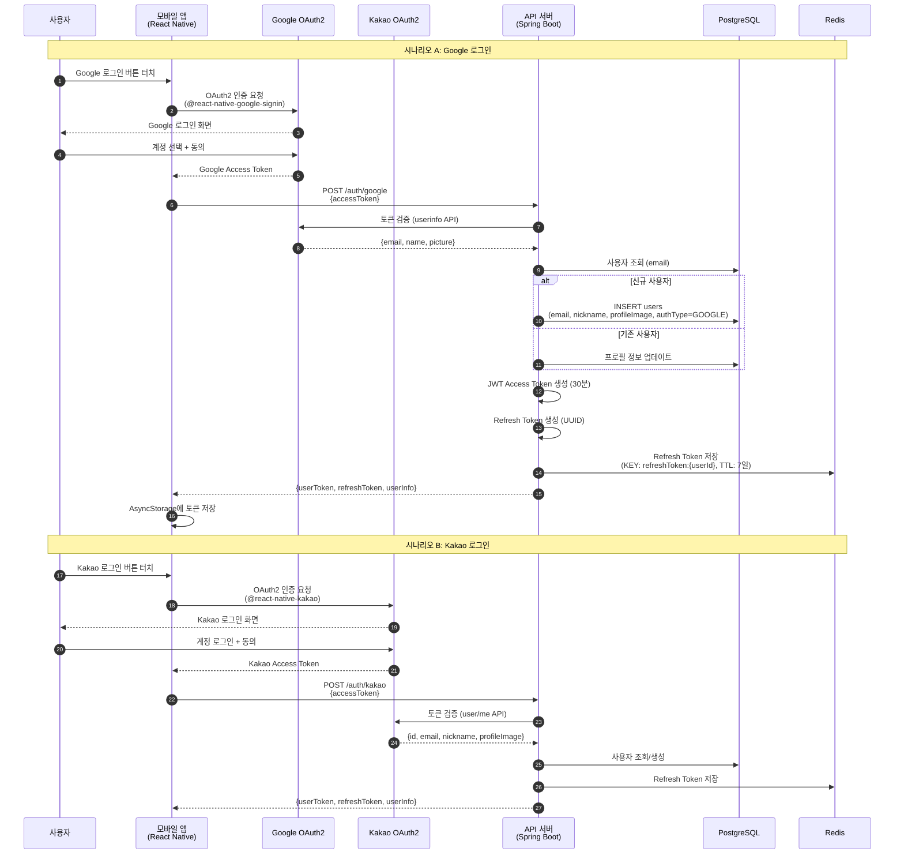
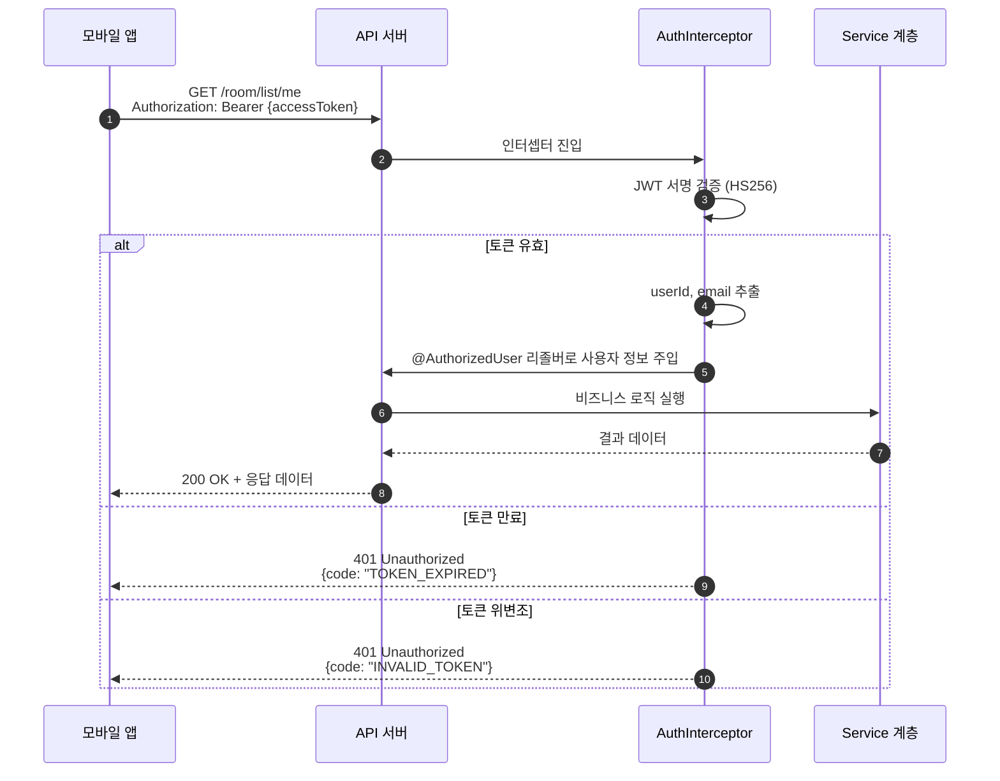
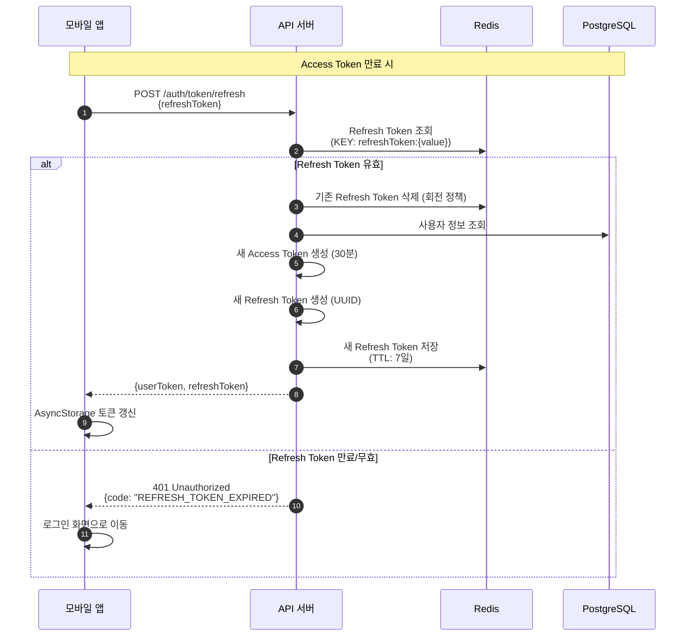
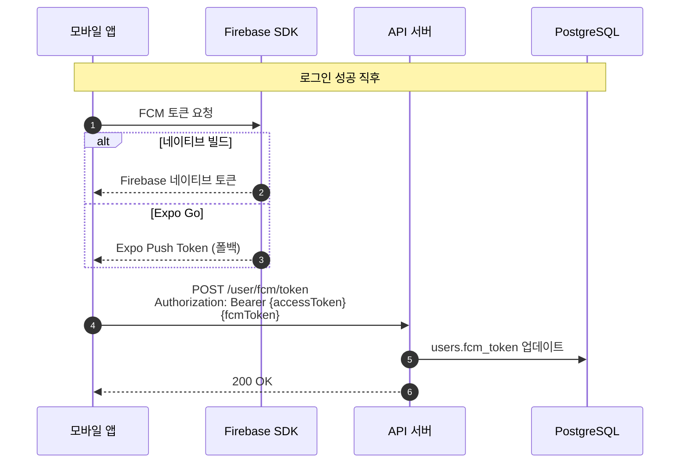

# 인증 흐름 시퀀스 다이어그램

> ADR 참조: [ADR-006 JWT + OAuth2 인증 전략](../adr/ADR-006-jwt-oauth2-auth.md)

## 1. 소셜 로그인 → JWT 발급

## 2. API 요청 시 JWT 인증

## 3. Access Token 갱신 (Refresh Token 회전)

## 4. FCM 토큰 등록

## 토큰 정책 요약

| 항목                  | 값                                    | 비고                       |
| --------------------- | ------------------------------------- | -------------------------- |
| Access Token 알고리즘 | HS256                                 | 단일 서버에 적합           |
| Access Token 만료     | 30분                                  | 탈취 시 피해 시간 제한     |
| Refresh Token 형식    | UUID v4                               | JWT 아님 (서버에서만 검증) |
| Refresh Token 만료    | 7일                                   | Redis TTL로 관리           |
| Refresh Token 저장    | Redis                                 | 강제 만료·회전 지원        |
| 회전 정책             | 사용 시 즉시 새 토큰 발급 + 이전 삭제 | 재사용 공격 방어           |
| FCM 토큰              | users 테이블에 저장                   | 로그인 시 갱신             |
