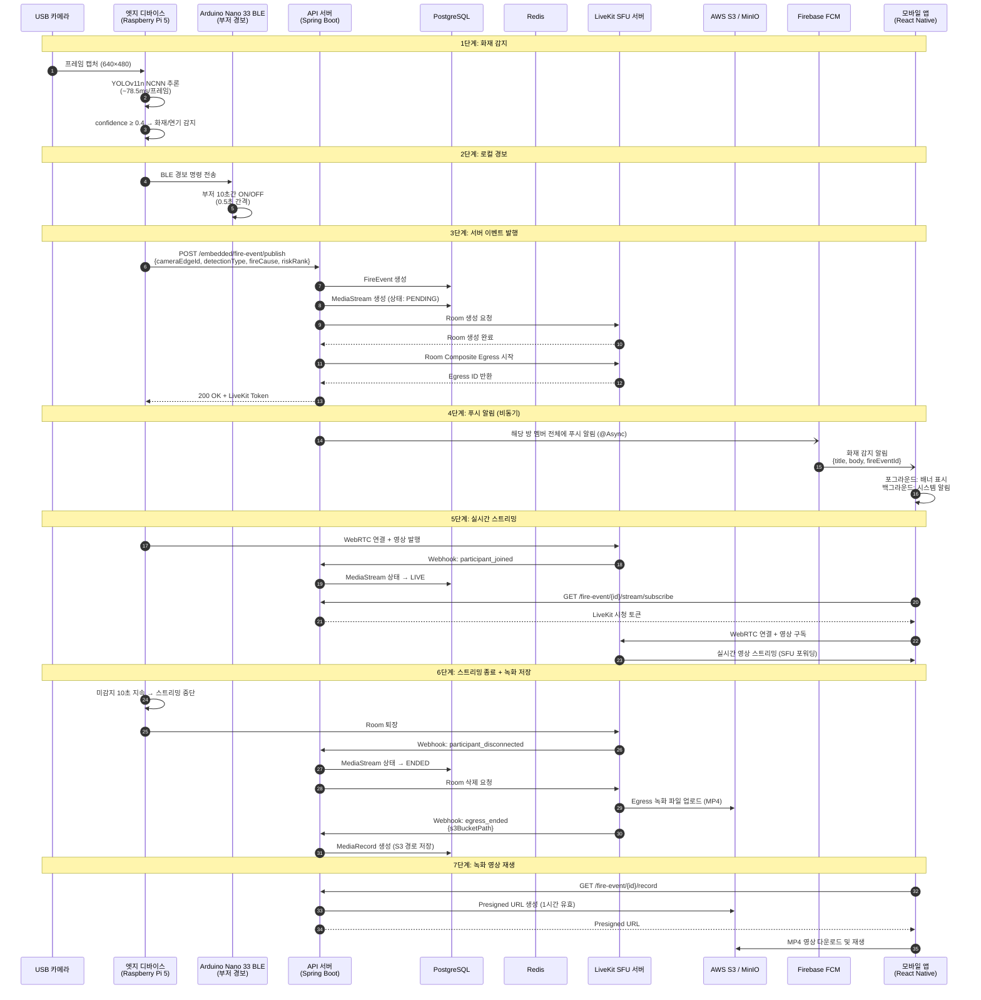

# 화재 감지 → 알림 → 스트리밍 시퀀스 다이어그램

> ADR 참조: [ADR-001 SFU/LiveKit](../adr/ADR-001-sfu-livekit.md), [ADR-002 YOLOv11n](../adr/ADR-002-yolov11n-ncnn.md), [ADR-008 Egress 녹화](../adr/ADR-008-webrtc-egress-recording.md)

## 전체 흐름

## 타이밍 요약

| 구간                             | 예상 소요 시간 |
| -------------------------------- | -------------- |
| 카메라 캡처 → YOLO 감지          | ~78.5ms        |
| 감지 → BLE 경보                  | ~200ms         |
| 감지 → 서버 이벤트 발행          | ~300ms         |
| 서버 → FCM 푸시 알림             | ~1-3초         |
| 서버 → LiveKit Room 생성         | ~500ms         |
| 엣지 → LiveKit 스트리밍 시작     | ~1-2초         |
| **화재 감지 → 모바일 알림 수신** | **~2-5초**     |

## 주요 설계 결정

1. **FCM 비동기 전송**: `@Async`로 푸시 알림을 비동기 처리하여 API 응답 지연 방지
2. **Egress 자동 시작**: Room 생성과 동시에 Egress를 시작하여 녹화 누락 방지
3. **자동 스트리밍 종료**: 미감지 10초 지속 시 자동 중단 + 재시작 60초 딜레이로 반복 방지
4. **Presigned URL**: S3 직접 접근 대신 시간 제한 URL로 영상 접근 제어
