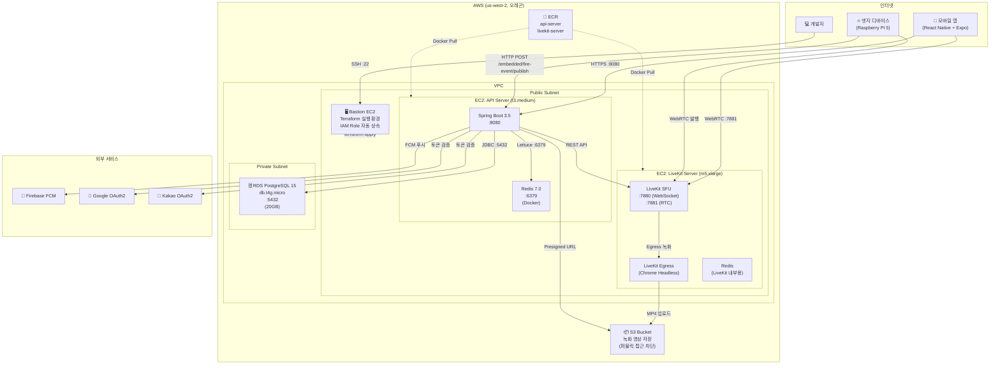
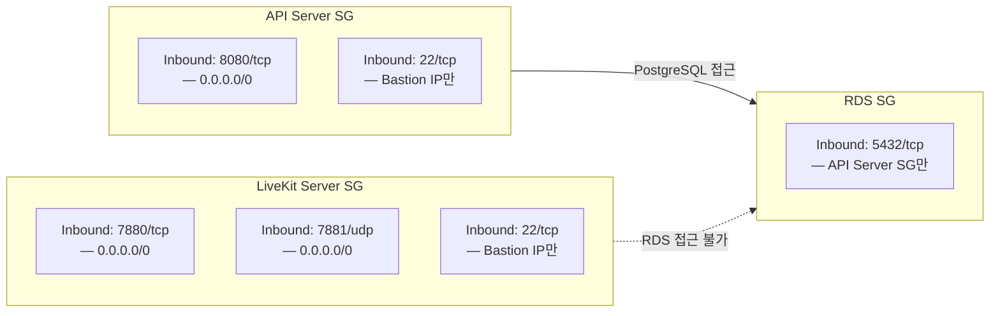
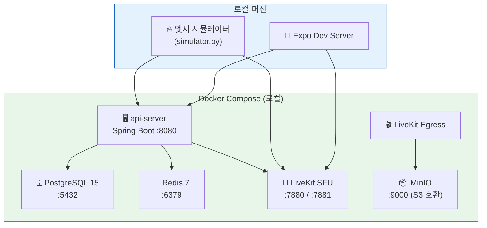
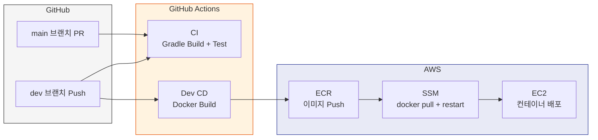

# 인프라 아키텍처 다이어그램

> ADR 참조: [ADR-007 Terraform IaC](../adr/ADR-007-terraform-iac.md), [ADR-001 SFU/LiveKit](../adr/ADR-001-sfu-livekit.md)

## AWS 프로덕션 아키텍처

## 보안 그룹 관계

## 로컬 개발 환경 (Docker Compose)

## 리소스 사양 및 비용

| 리소스           | 사양                       | 월 비용 (추정) | 비고                |
| ---------------- | -------------------------- | -------------- | ------------------- |
| EC2 (API Server) | t3.medium (2 vCPU, 4GB)    | ~$30           | Spring Boot + Redis |
| EC2 (LiveKit)    | m5.xlarge (4 vCPU, 16GB)   | ~$140          | WebRTC CPU 집약적   |
| RDS              | db.t4g.micro (2 vCPU, 1GB) | ~$15           | PostgreSQL 15, 20GB |
| S3               | Standard                   | ~$1            | 녹화 영상 저장      |
| ECR              | 2 레포                     | ~$1            | Docker 이미지       |
| 데이터 전송      | -                          | ~$10           | WebRTC 트래픽       |
| **합계**         |                            | **~$197**      |                     |

## CI/CD 파이프라인

### CI/CD 인증

- **OIDC 기반**: GitHub Actions → AWS IAM Role (`inha-capstone-04-cicd-role`)
- 시크릿 키 없이 임시 자격 증명으로 ECR Push + SSM 명령 실행
